# 1. 배열의 기초


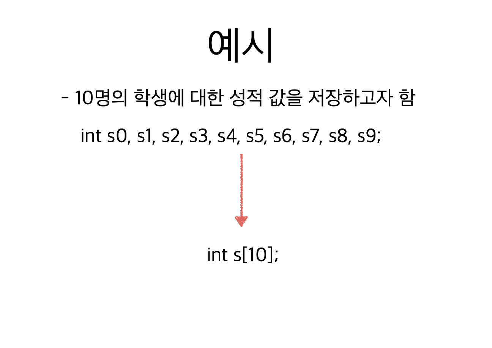

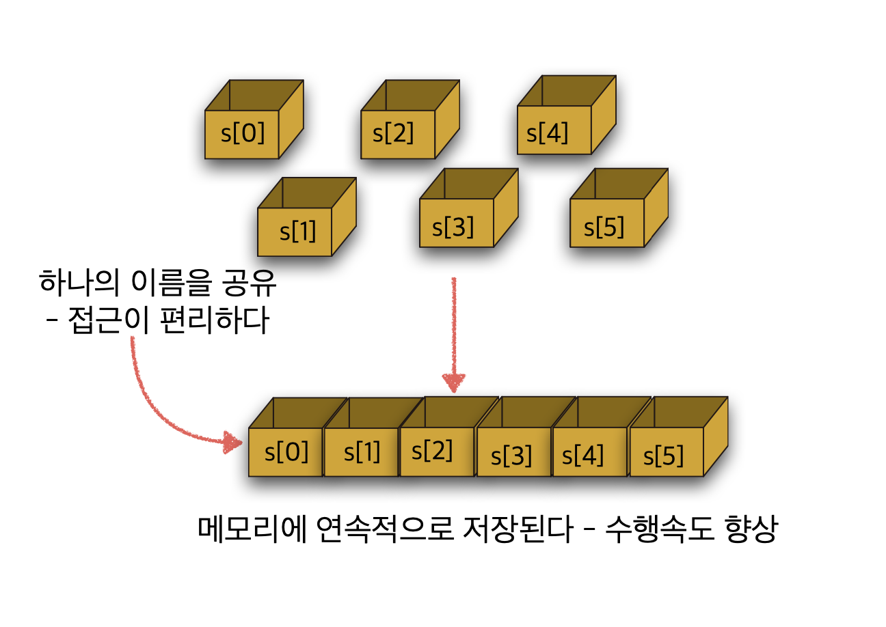

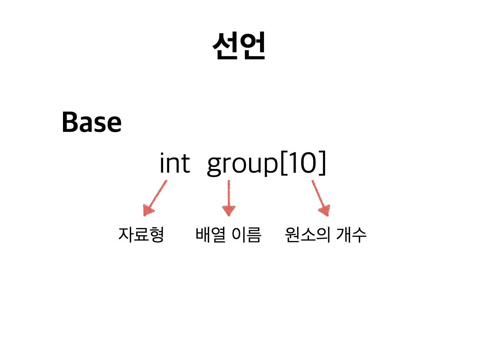

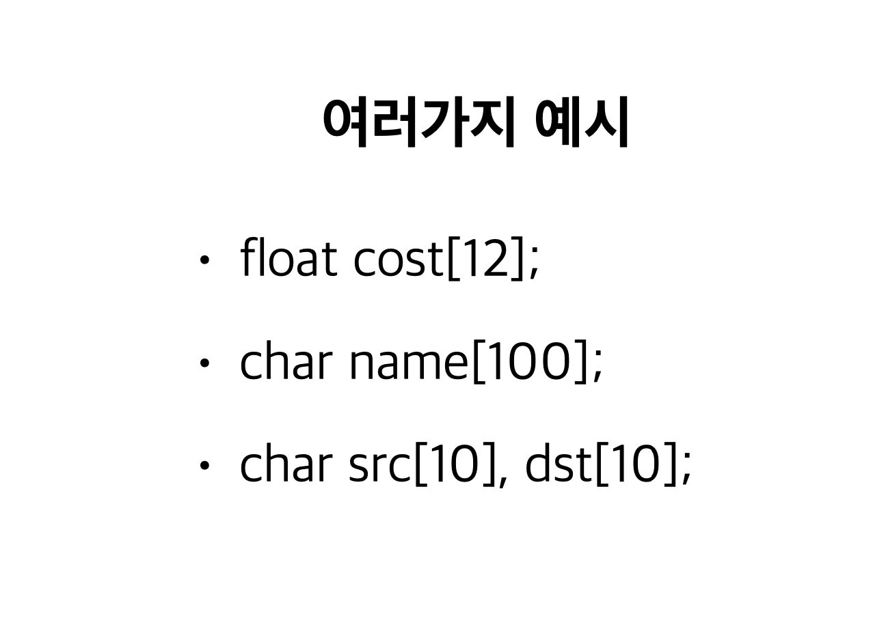

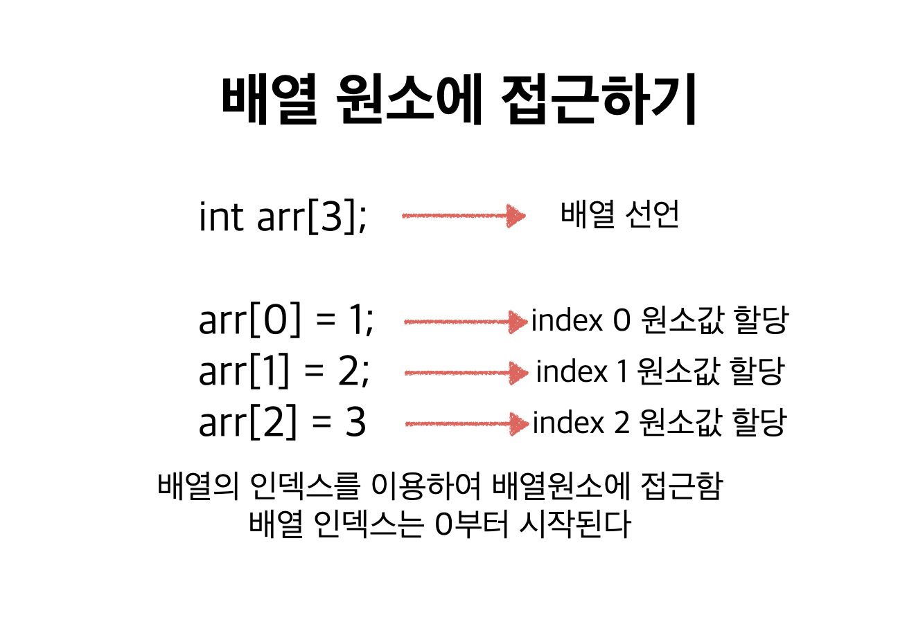

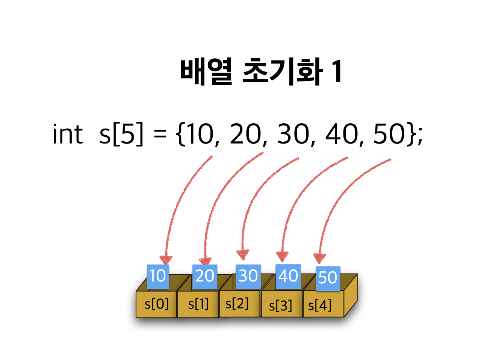

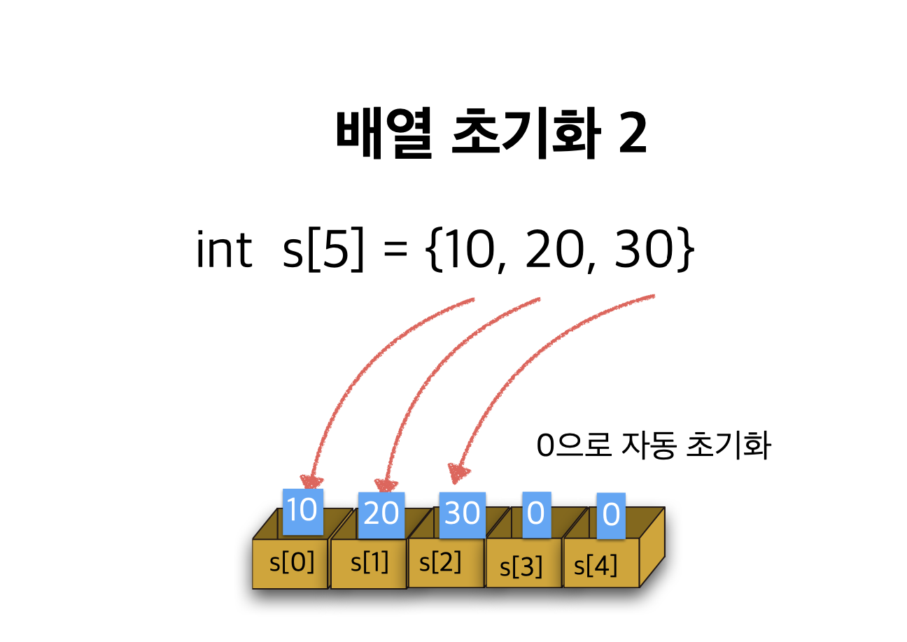

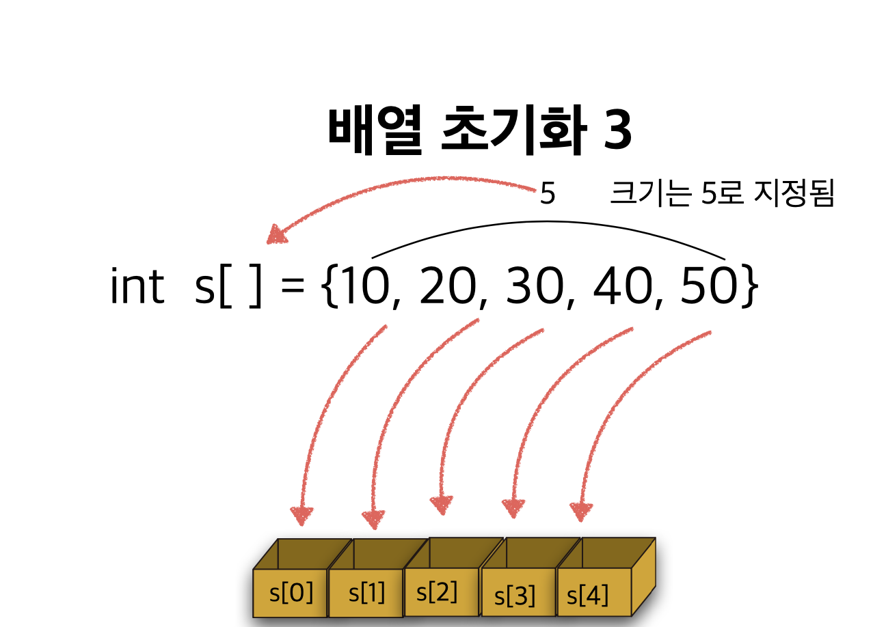

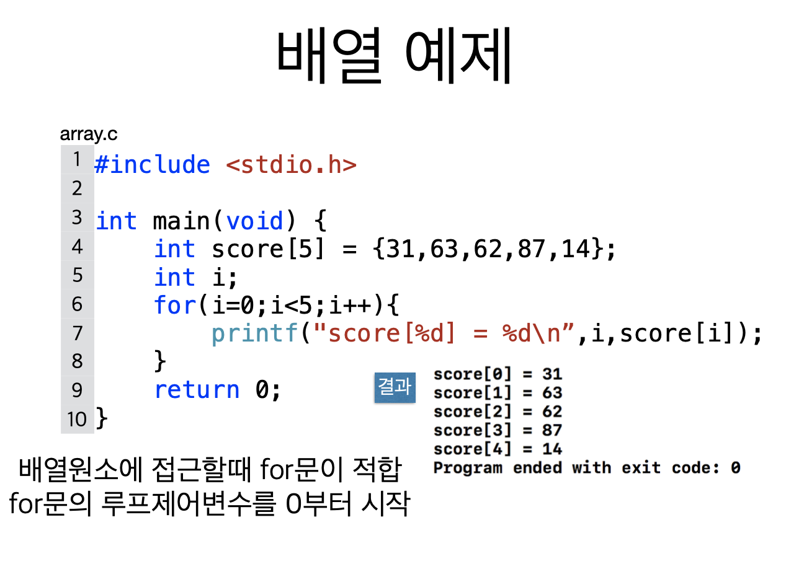

```text
#include <stdio.h>

int main(void) {
    int score[5] = {31, 63, 52, 87, 14};
    int i;
    
    for (i=0; i<5; i++) {
        printf("score[%d] = %d\n", i, score[i]);
    }
    return 0;
}

```

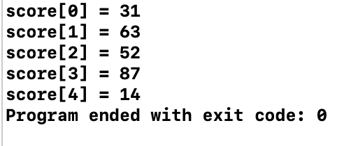

```c
#include <stdio.h>

int main(void) {
    int score[5] = {31, 63, 52};
    int i;
    
    for (i=0; i<5; i++) {
        printf("score[%d] = %d\n", i, score[i]);
    }
    return 0;
}
```

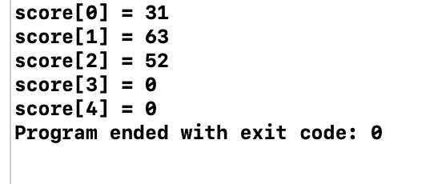

```c
#include <stdio.h>

int main(void) {
    int score[] = {31, 63, 52};
    int i;
    
    for (i=0; i<5; i++) {
        printf("score[%d] = %d\n", i, score[i]);
    }
    return 0;
}
```

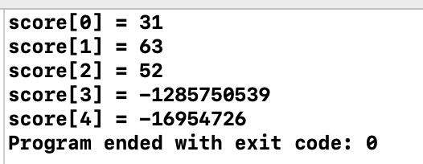

