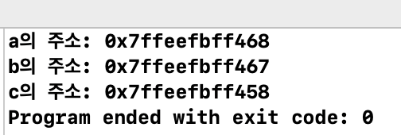

# 1. 포인터


```c
#include <stdio.h>

int main(void) {
    int a = 10;
    char b = 'c';
    double c = 170.2;
    
    printf("a의 주소: %p\n", &a);
    printf("b의 주소: %p\n", &b);
    printf("c의 주소: %p\n", &c);
    
    return 0;
}
```




```c
#include <stdio.h>

int main(void) {
    int i = 10;
    double f = 12.3;
    int *pi = NULL;
    double *pf = NULL;
    
    pi = &i;
    pf = &f;
    
    printf("%p %p\n", pi, &i);
    printf("%p %p\n", pf, &f);
    
    return 0;
}
```


