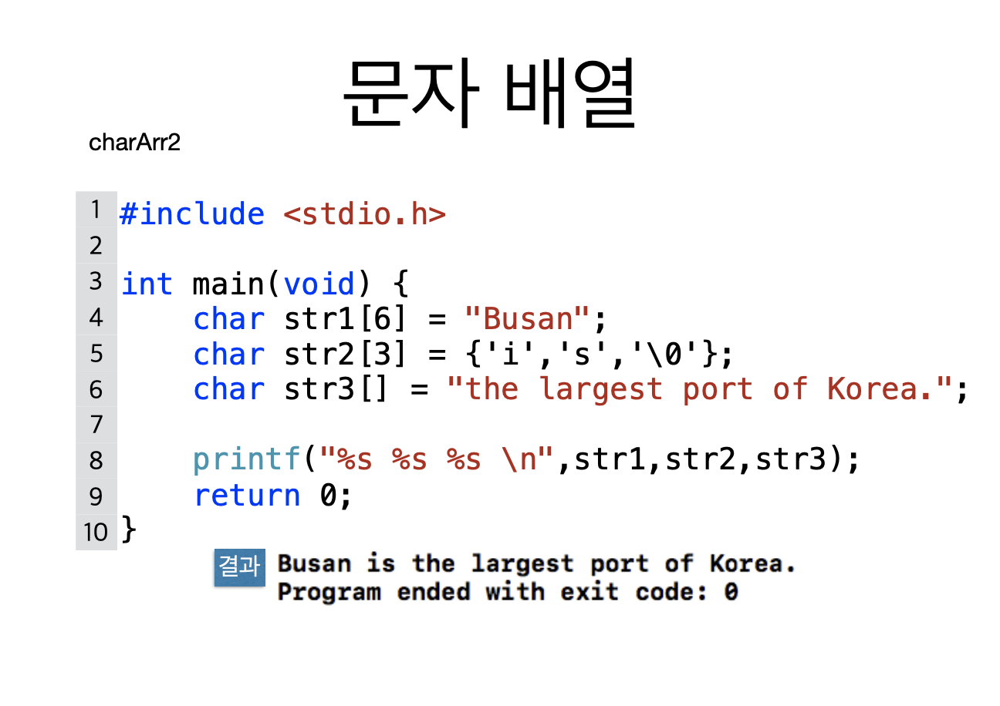

# 1. 문자열


```c
#include <stdio.h>

int main(void) {
    int i;
    char str[4];
    
    str[0] = 'a';
    str[1] = 'b';
    str[2] = 'c';
    str[3] = '\0';
    
    i = 0;
    while (str[i] != '\0') {
        printf("%c", str[i]);
        i++;
    }
    
    printf("\n%s\n", str);
    
    return 0;
}
```




```c
#include <stdio.h>

int main(void) {
    char str1[6] = "Busan";
    char str2[3] = {'i', 's', '\0'};
    char str3[] = "the largest port of Korea.";
    
    printf("%s %s %s \n", str1, str2, str3);
    
    return 0;
}
```


