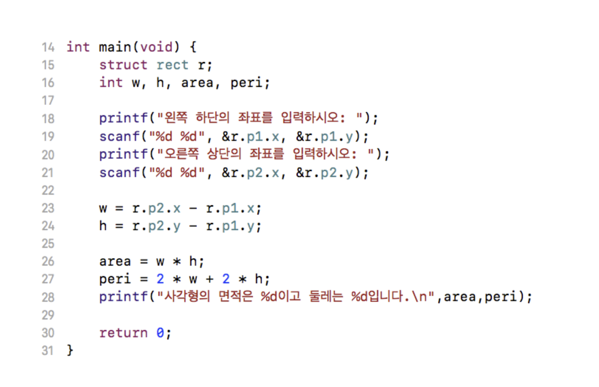

# 1. 구조체


```c
#include <stdio.h>
#include <stdlib.h>

struct student {
    int student_id;
    char name[10];
    double grade;
};

int main(void) {
    struct student s = {20170001, "kim", 3.4};  // 초기화
    
    printf("학번: %d\n", s.student_id);
    printf("이름: %s\n", s.name);
    printf("학점: %f\n", s.grade);
    
    // 각각을 수정하고 싶을 
    s.student_id = 20170001;
    // s.name = "홍길동"; 이렇게 하면 안됨
    strcpy(s.name, "홍길동");
    s.grade = 4.3;
    
    printf("학번: %d\n", s.student_id);
    printf("이름: %s\n", s.name);
    printf("학점: %f\n", s.grade);
    
    return 0;
}
```





```c
// x, y 좌표값을 가지는 point 라는 구조체 선언
struct point {
    int x;
    int y;
};

// 두 개의 point를 멤버로 가지는 rect 구조체 선언
struct rect {
    struct point p1;
    struct point p2;
};

int main(void) {
    struct rect r;
    int w, h, area, peri;
    
    printf("왼쪽 하단의 좌표를 입력하시오: ");
    scanf("%d %d", &r.p1.x, &r.p1.y);
    
    printf("오른쪽 상단의 좌표를 입력하시오: ");
    scanf("%d %d", &r.p2.x, &r.p2.y);
    
    w = r.p2.x - r.p1.x;
    h = r.p2.y - r.p1.y;
    
    area = w * h;
    peri = (2 * w) + (2 * h);
    printf("사각형읜 면적은 %d이고, 둘레는 %d입니다.\n", area, peri);
    
    return 0;
}
```


