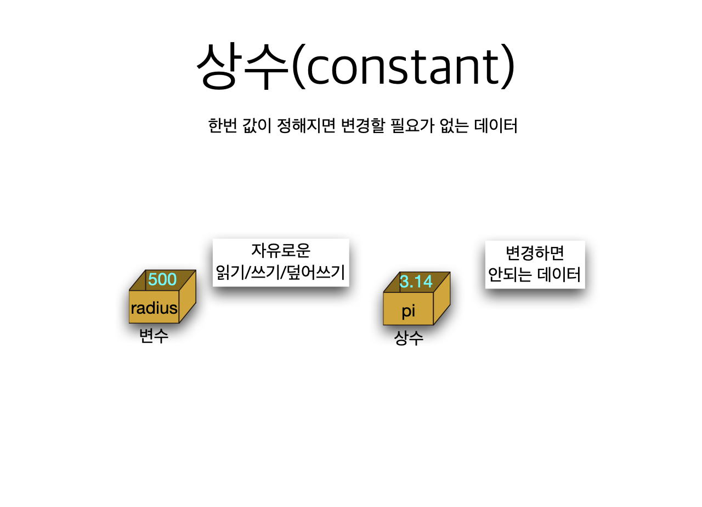
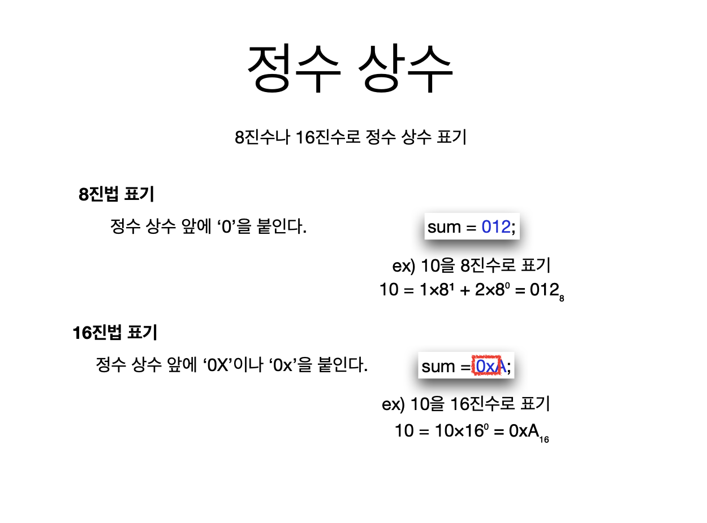

# 2. 오버플로우, 상수, 매크로


* short 가 저장할수 있는 가장 큰 값이 32767 인데 거기서 만약 1을 증가시키면 오버플로우가 발생한다. \(한정된 범위를 넘어섰기 때문이다\)








* 값이 변경됐을 경우 리터럴표기는 모든 값을 하나하나씩 다 바꿔줘야 하는 반면, 기호상수는 \#define 이라고 표시된 상수의 값만 바꾸면 된다


## 환율을 계산하는 프로그램\(Using \#define\)

```c
/*
 환율을 계산하는 프로그램
 */
#include <stdio.h>
#define EXCHANGE_RATE 1120

int main(int argc, const char * argv[]) {
    int won1, won2;
    int dollar1 = 1, dollar2 = 2;
    
    won1 = EXCHANGE_RATE * dollar1;
    won2 = EXCHANGE_RATE * dollar2;
    
    printf("%d달러는 %d원 입니다\n", dollar1, won1);
    printf("%d달러는 %d원 입니다\n", dollar2, won2);
    
    return 0;
}

```


## 환율을 계산하는 프로그램\(Using const\)

```c
#include <stdio.h>

int main(int argc, const char * argv[]) {
    const int EXCHANGE_RATE = 1120;
    
    int won1, won2;
    int dollar1 = 1, dollar2 = 2;
    
    won1 = EXCHANGE_RATE * dollar1;
    won2 = EXCHANGE_RATE * dollar2;
    
    printf("%d달러는 %d원 입니다\n", dollar1, won1);
    printf("%d달러는 %d원 입니다\n", dollar2, won2);
    
    return 0;
}
```

### \#define 과 const 의 차이점은 \#define 을 사용시 값을 변경할 때EXCHANGE\_RATE 1100.5; 와 같이 실수형에 맞게 아래에 상수변수도 변경하지만, const int EXCAHNGE\_RATE 와 같이 int 형으로 고정된 값에서는 EXCHANGE\_RATE = 1100.5; 와 같이 변경 하면 정수부분만 계산되고 소수부분은 삭제된다.


