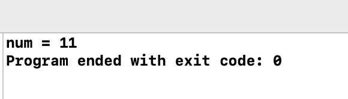

# 2. 함수 정의


```text
#include <stdio.h>

int add(int x, int y) {
    int result;
    result = x + y;
    return result;
}

int main(void) {
    int num;
    num = add(3, 8);
    printf("num = %d\n", num);
    
    return 0;
}

```




```c
#include <stdio.h>

int get_max(int x, int y) {
    if (x > y)
        return x;
    else
        return y;
}

int main(void) {
    printf("%d\n", get_max(2, 5));
    printf("%d\n", get_max(10, 7));
    
    return 0;
}
```


```c

#include <stdio.h>

int factorial(int n) {
    int i;
    int result = 1;
    
    for (i=1; i<=n; i++)
        result *= i;
    
    return result;
}

int main(void) {
    printf("3! = %d\n", factorial(3));
    printf("5! = %d\n", factorial(5));
    
    return 0;
}

```


