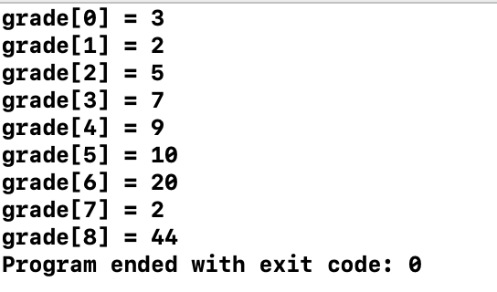

# 2. 배열의 응용 - 탐색


```c
#include <stdio.h>

int main(void) {
    int grade[] = {3, 2, 5, 7, 9, 10, 20, 2, 44};
    int i = 0, size;
    
    size = sizeof(grade) / sizeof(grade[0]);
    
    for (i=0; i<size; i++) {
        printf("grade[%d] = %d\n", i, grade[i]);
    }
    
    return 0;
}

```



* 즉 sizeof\(grade\) / sizeof\(grade\[0\]\) 를 하는 이유는 전체 정수형의 크기를 하나의 정수형 크기를 나누기를 하면 몇 개인지 알 수 있기 때문이다.


```c
#include <stdio.h>

int main(void) {
    int key, array[40];
    
    for (int i=0; i<40; i++) {
        array[i] = i*10;
    }
    
    printf("Which elemeny do you want to find? ");
    scanf("%d", &key);
    
    for (int i=0; i<40; i++) {
        if (array[i] == key)
            printf("#%d found at location %d\n", key, i+1);
    }
    
    return 0;
}
```


```c
/*
 Binary Search
 */

#include <stdio.h>

int main(void) {
    int first, middle, last, key, array[40];
    
    for (int i=0; i<40; i++)
        array[i] = i*10;
    
    printf("Enter key: ");
    scanf("%d", &key);
    
    first = 0; last = 40 - 1;
    middle = (first + last) / 2;
    
    while (first <= last) {
        if (array[middle] < key) {
            first = middle + 1;
        } else if (array[middle] == key) {
            printf("#%d fond at location %d.\n", key, middle+1);
            break;
        } else {
            last = middle - 1;
        }
        middle = (first + last) / 2;
    }
    
    if (first > last)
        printf("Not found! %d is not present.\n", key);
    
    return 0;
}
```


