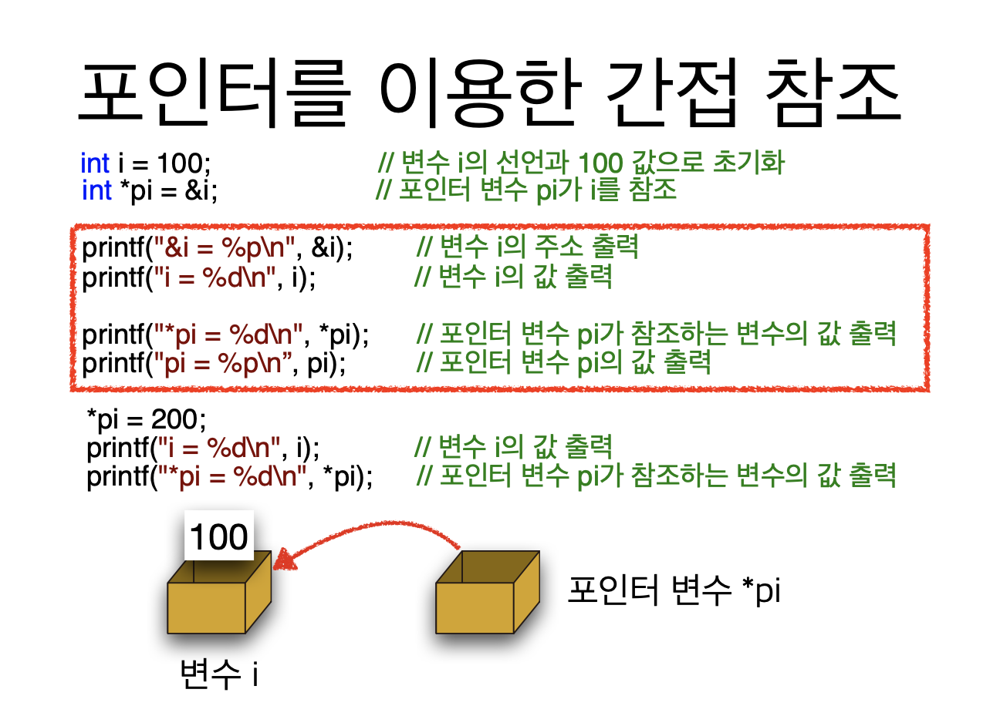
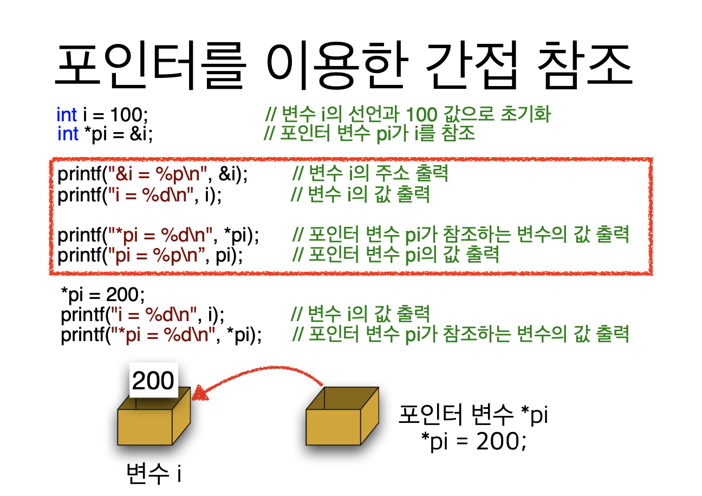
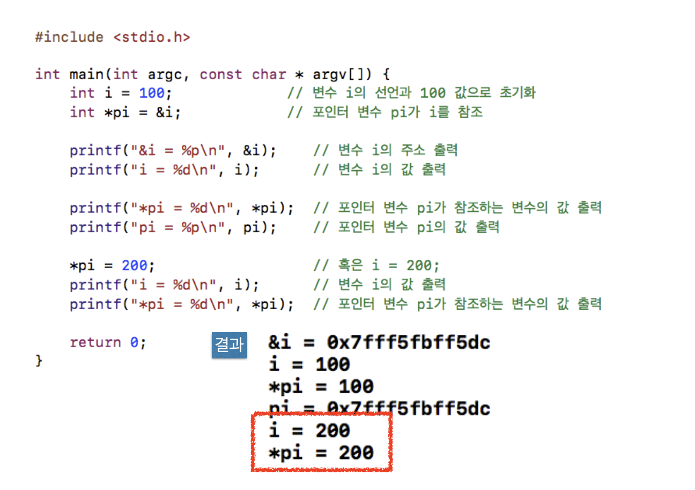
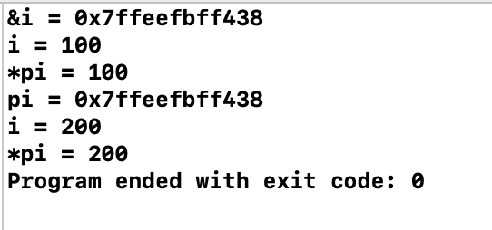
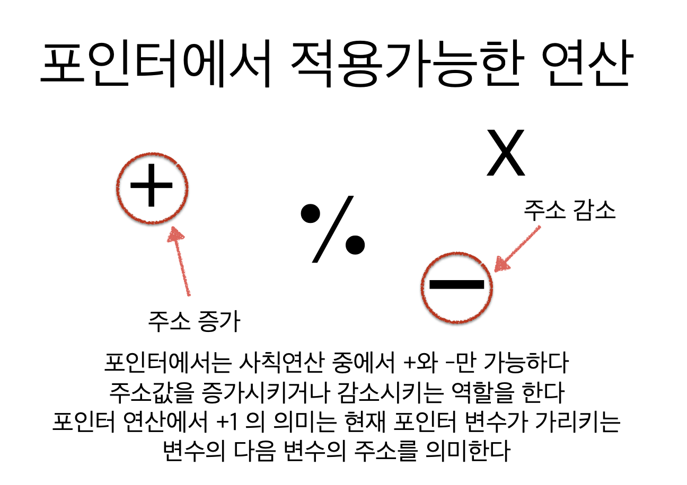
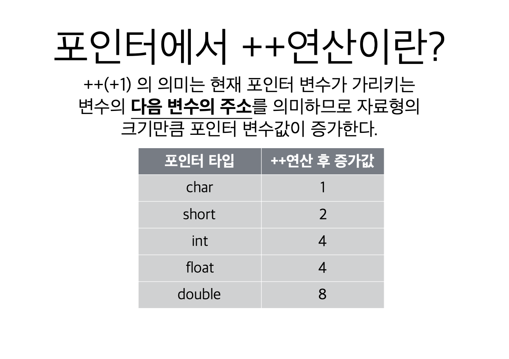
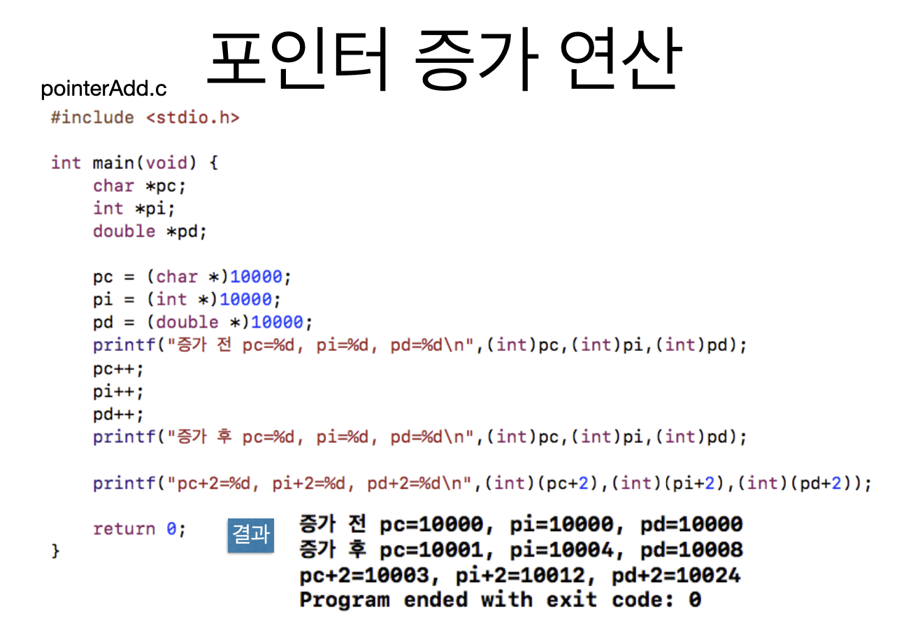
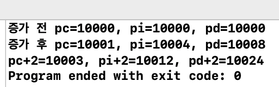

# 2. 포인터 연산







```c
#include <stdio.h>

int main(void) {
    int i = 100;                // 변수 i의 선언과 100 값으로 초기화
    int *pi = &i;               // 포인터 변수 pi 가 i의 주솟값 참조
    
    printf("&i = %p\n", &i);    // 변수 i의 주소 출력
    printf("i = %d\n", i);      // 변수 i의 값 출력
    
    printf("*pi = %d\n", *pi);  // 포인터 변수 pi가 참조하는 변수의 값 출력
    printf("pi = %p\n", pi);    // 포인터 변수 pi의 값 출력
    
    *pi = 200;
    printf("i = %d\n", i);      // 변수 i의 값 출력
    printf("*pi = %d\n", *pi);  // 포인터 변수 pi가 참조하는 변수의 값 출력
    
    return 0;
}

```









```c
#include <stdio.h>

int main(void) {
    char *pc;
    int *pi;
    double *pd;
    
    pc = (char *)10000;
    pi = (int *)10000;
    pd = (double *)10000;
    
    printf("증가 전 pc=%d, pi=%d, pd=%d\n", (int)pc, (int)pi, (int)pd);
    
    pc++;
    pi++;
    pd++;
    
    printf("증가 후 pc=%d, pi=%d, pd=%d\n", (int)pc, (int)pi, (int)pd);
    
    printf("pc+2=%d, pi+2=%d, pd+2=%d\n", (int)(pc+2), (int)(pi+2), (int)(pd+2));
    
    return 0;
}
```




