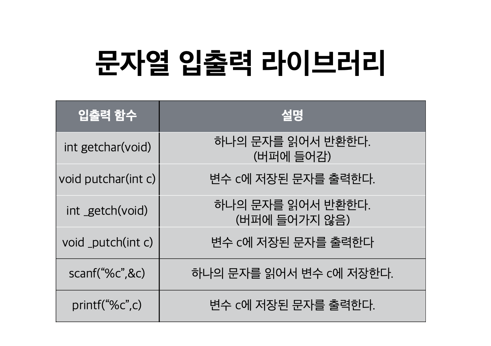
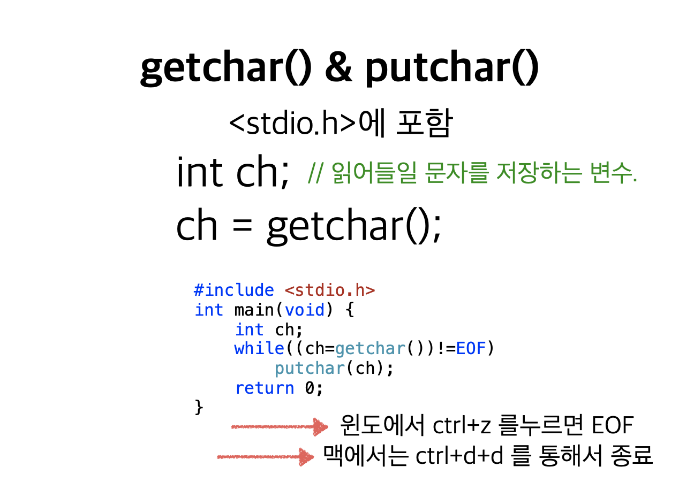
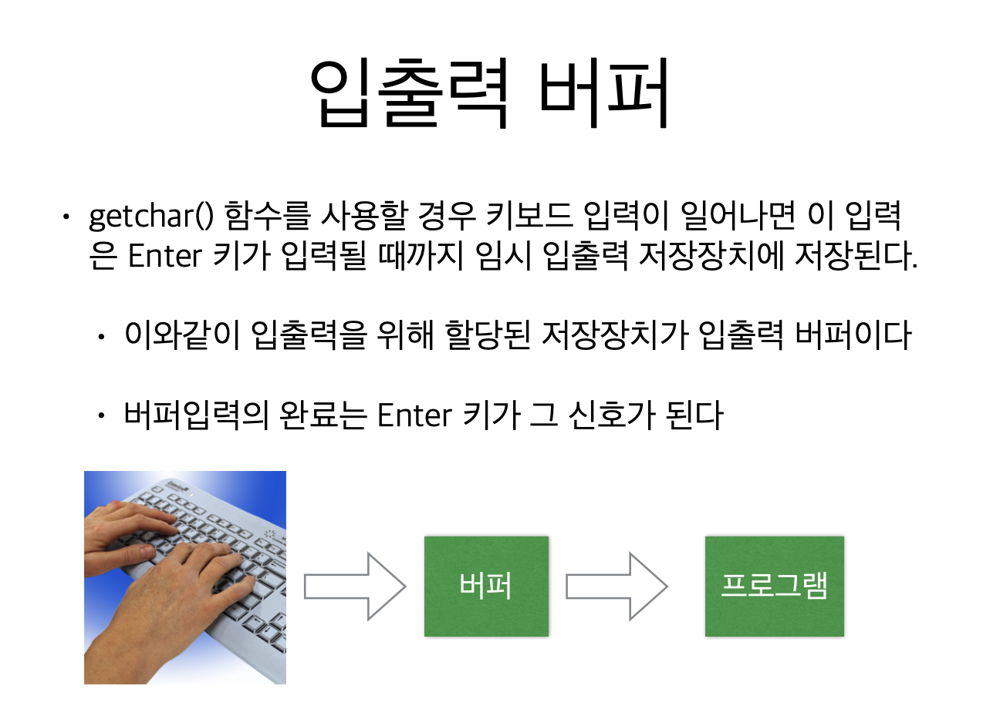
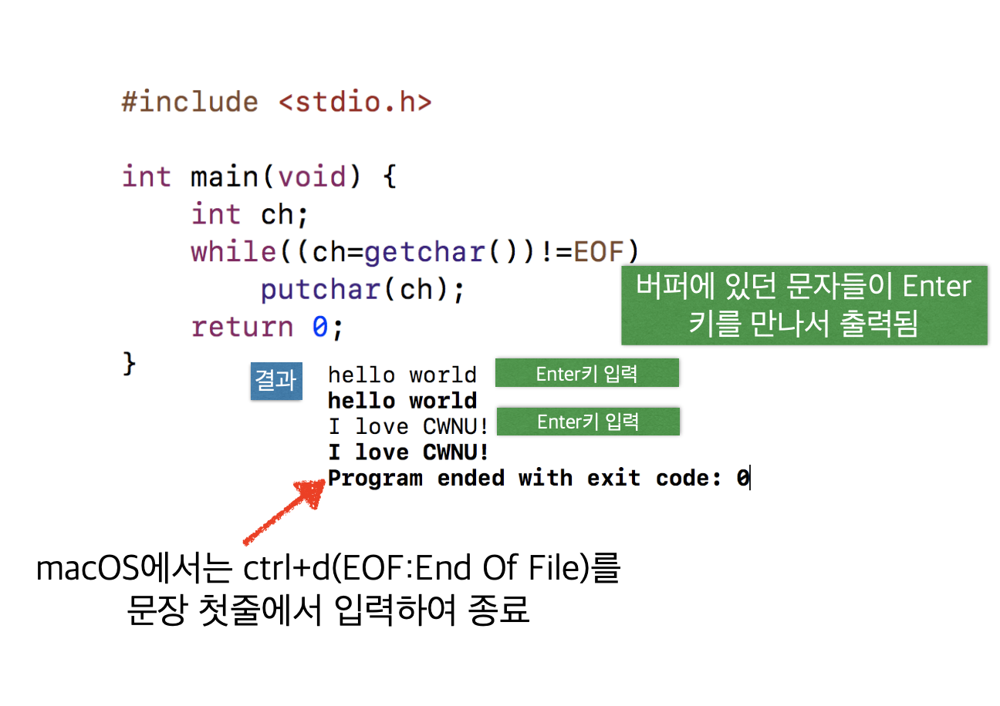
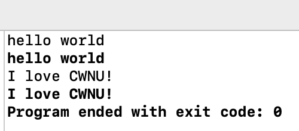
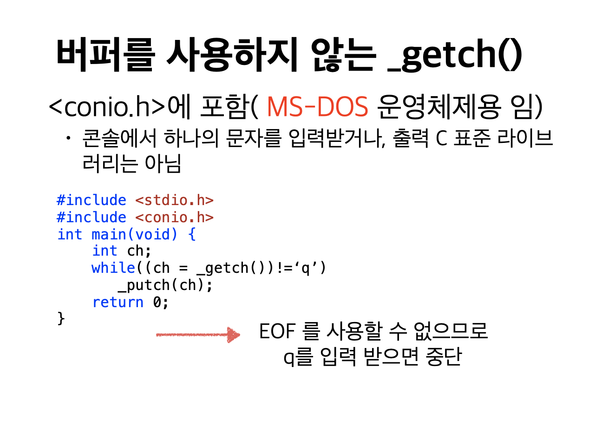
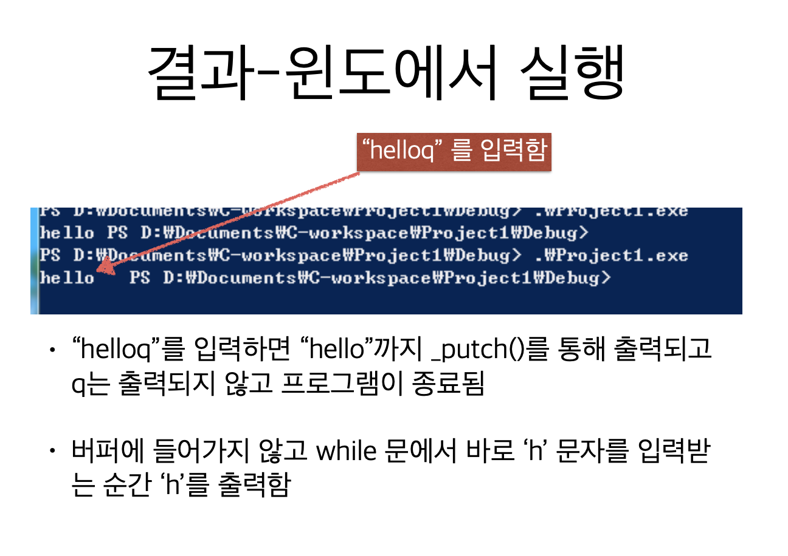

# 2. 문자열 응용









```c
#include <stdio.h>

int main(void) {
    int ch;
    
    while ((ch=getchar()) != EOF)
        putchar(ch);
    return 0;
}

```



* 엔터키가 들어오기 전까지 처리하지 않다가, 엔터키를 치면 버퍼에 넣고 처리






