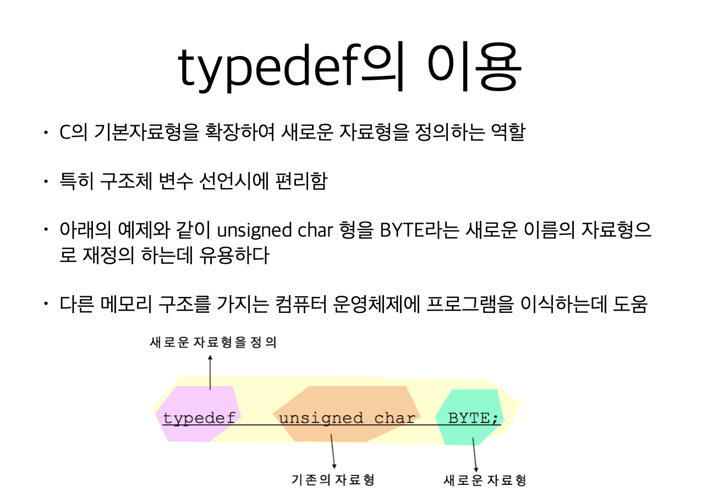
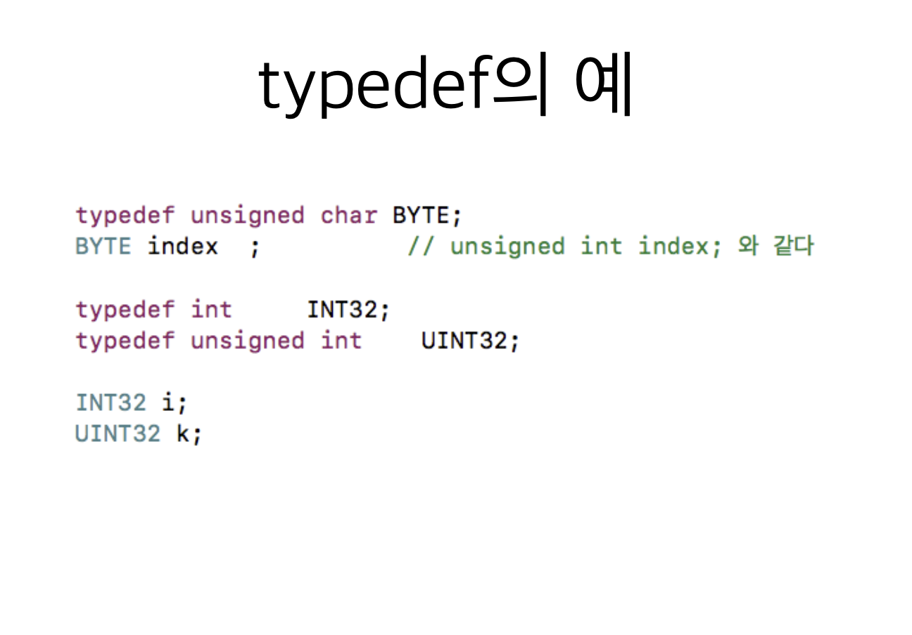
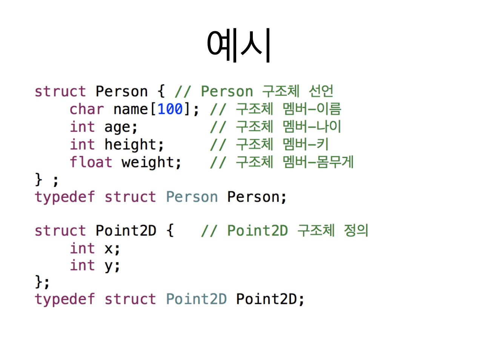
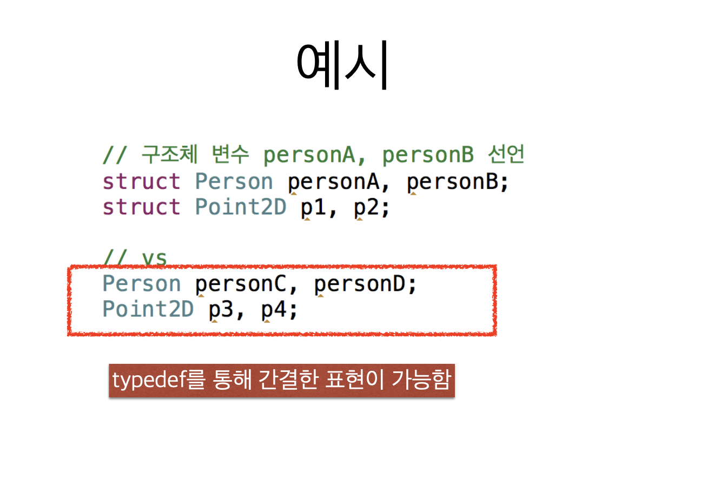
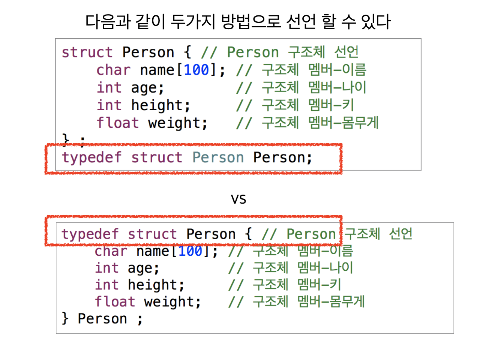
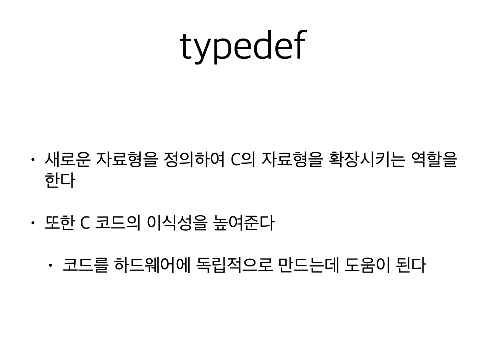

# 2. 구조체와 typedef













```c
#include <stdio.h>

// typedef를 이용한 정의 1
//struct Person {
//    char name[100];
//    int age;
//    int height;
//    float weight;
//};
//typedef struct Person Person;


// typedef를 이용한 정의 2
typedef struct Person {
    char name[100];
    int age;
    int height;
    float weight;
} Person;

struct Point2D {
    int x;
    int y;
};
typedef struct Point2D Point2D;

int main(void) {
    // 구조체 변수 personA, personB 선언
    Person personA, personB;
    Person p1, p2;
}
```

