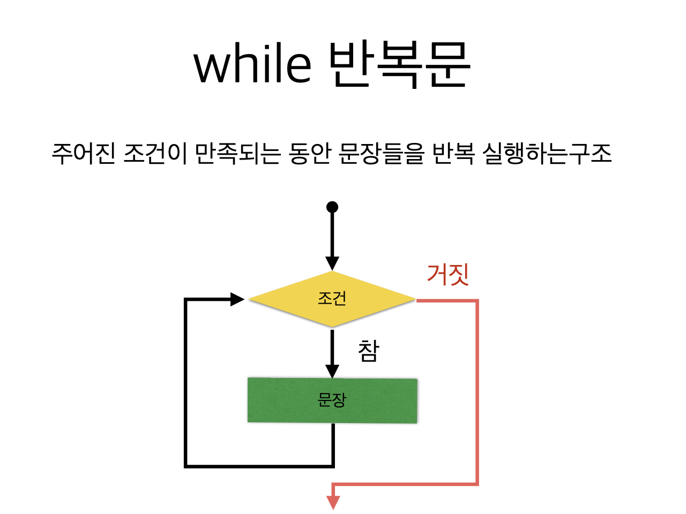
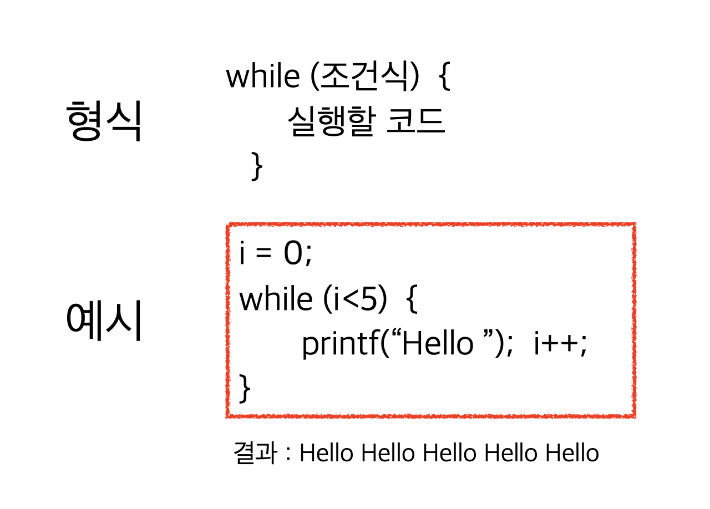
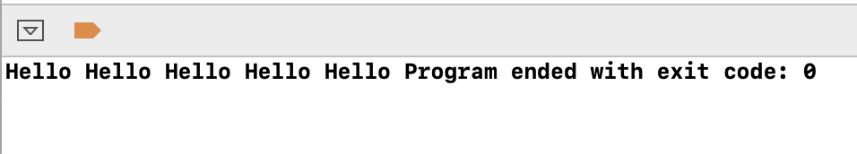
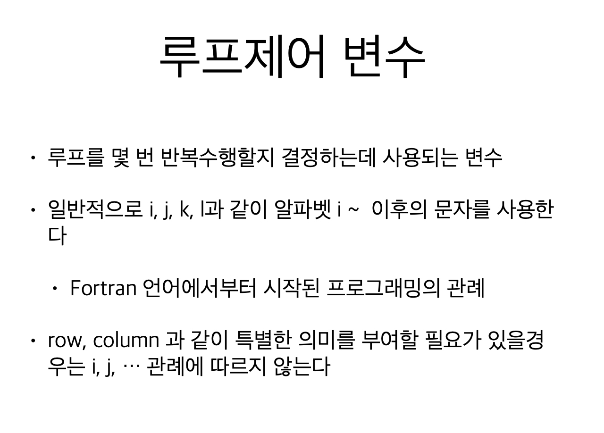
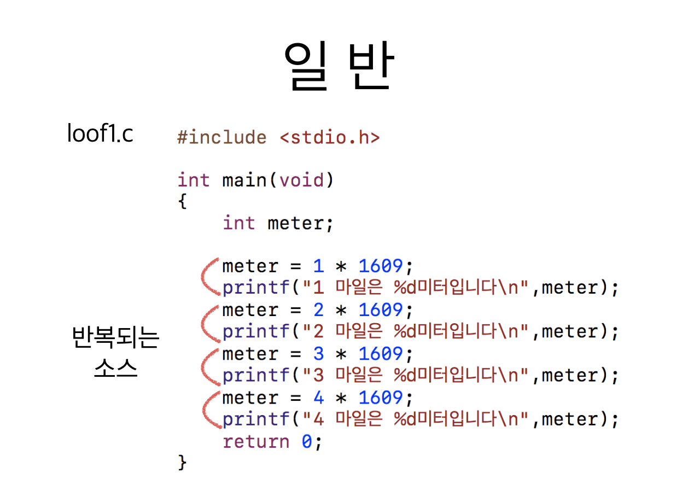
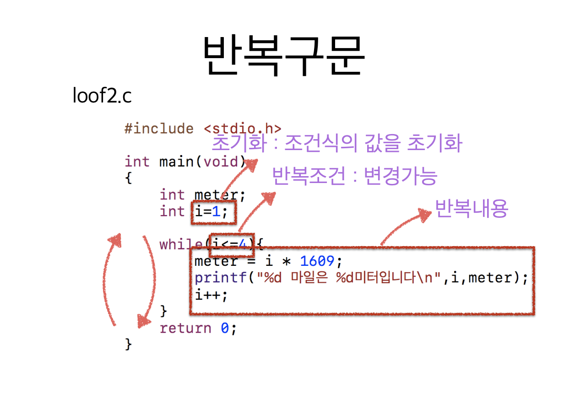
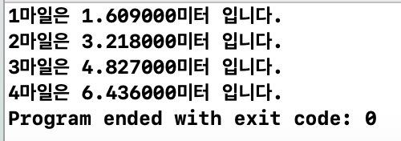
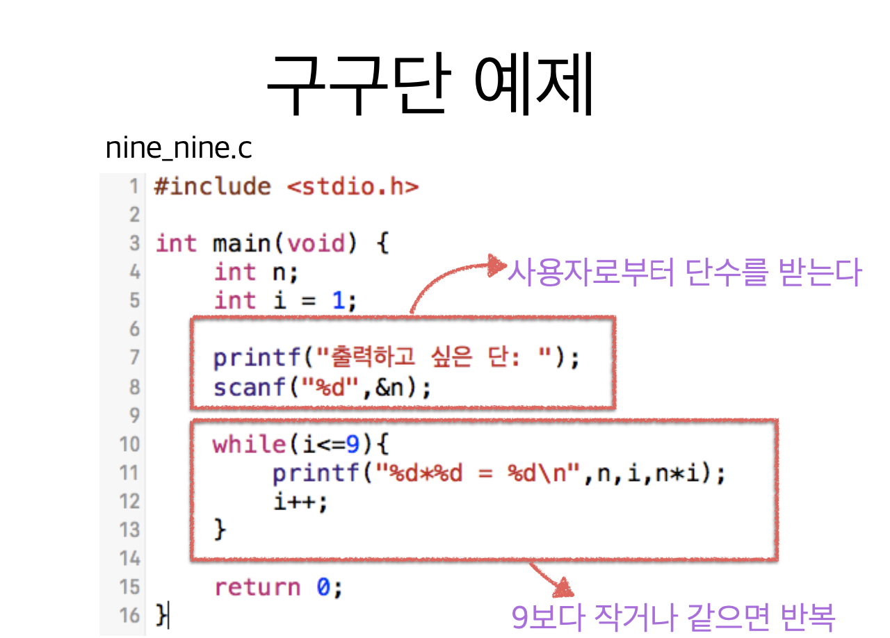
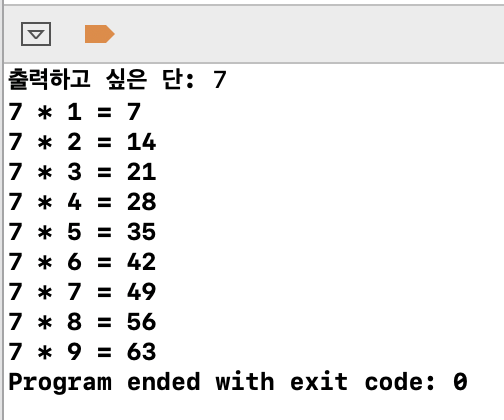

# 2. while 반복문





```c
#include <stdio.h>

int main(void) {
    int i = 0;          // 루프제어 변수 초기화
    while (i < 5) {     // 조건문
        printf("Hello ");
        i++;            // 증감문
    }
    return 0;
}

```









```c
#include <stdio.h>

int main(void) {
    float meter;
    int i = 1;
    
    while (i <= 4) {
        meter = i * 1.609;
        printf("%d마일은 %f미터 입니다.\n", i, meter);
        i++;
    }
    return 0;
}
```





```c
#include <stdio.h>

int main(void) {
    int n;
    int i = 1;
    
    printf("출력하고 싶은 단: ");
    scanf("%d", &n);
    
    while (i <= 9) {
        printf("%d * %d = %d\n", n, i, n * i);
        i++;
    }
    return 0;
}
```



