# 2. Xcode 개발 도구

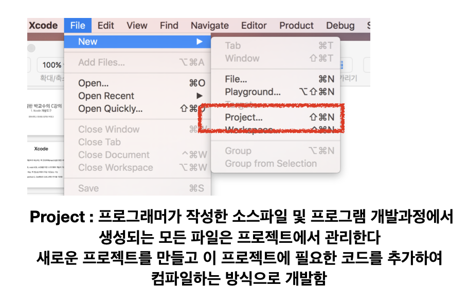

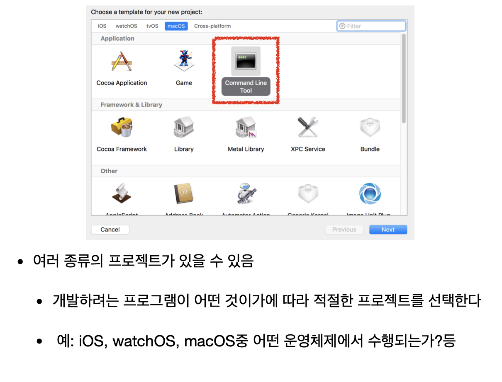

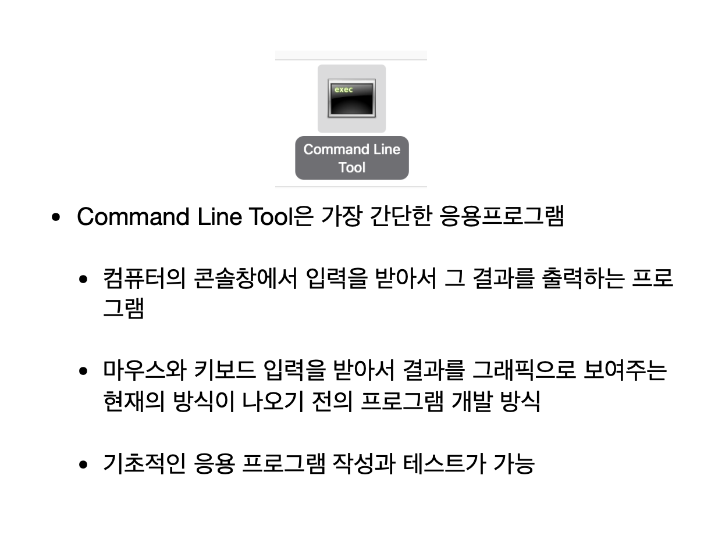

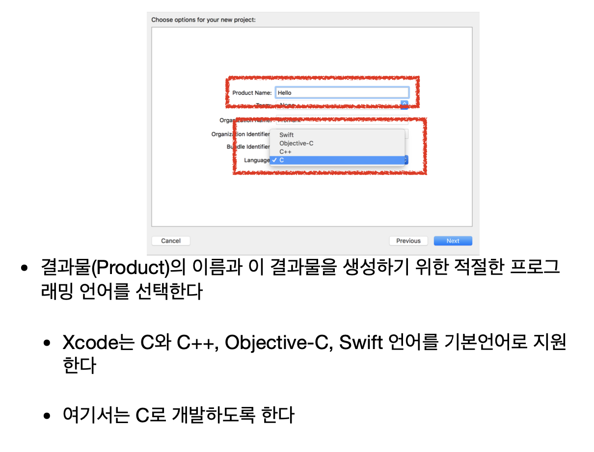

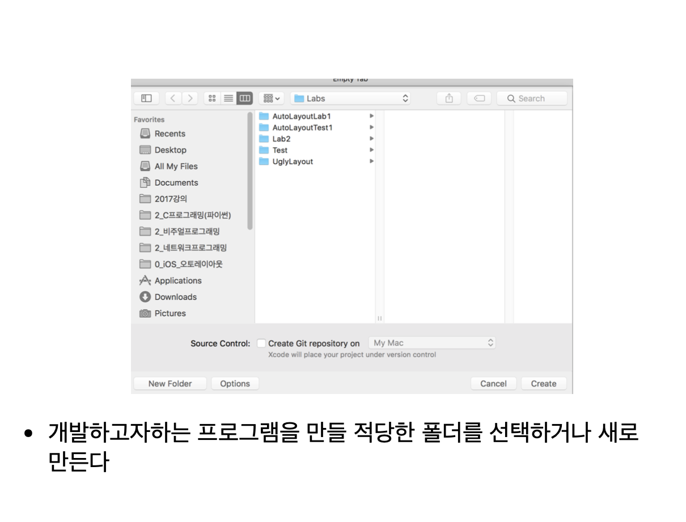

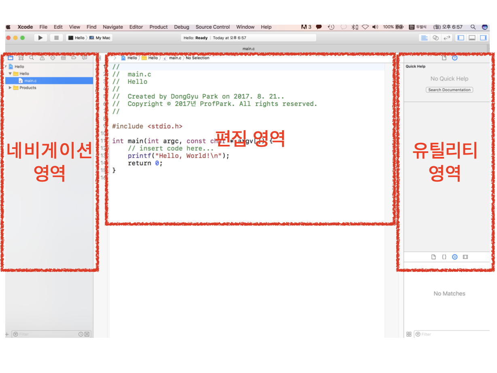

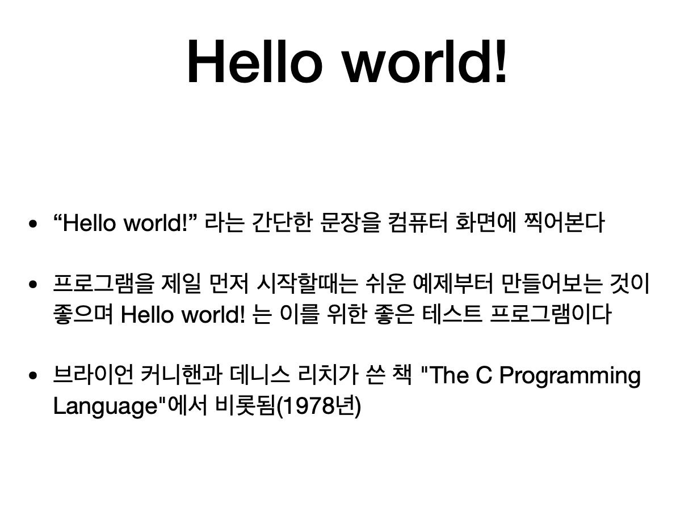

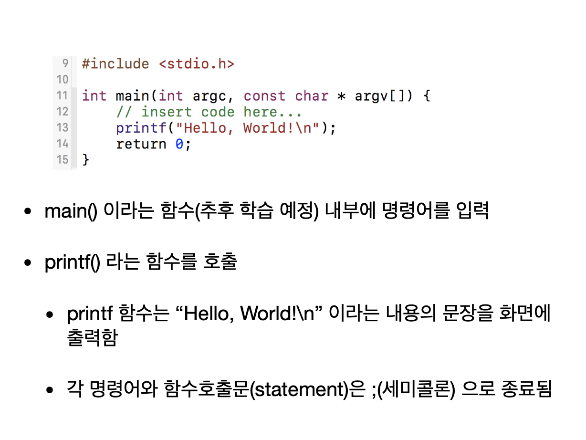

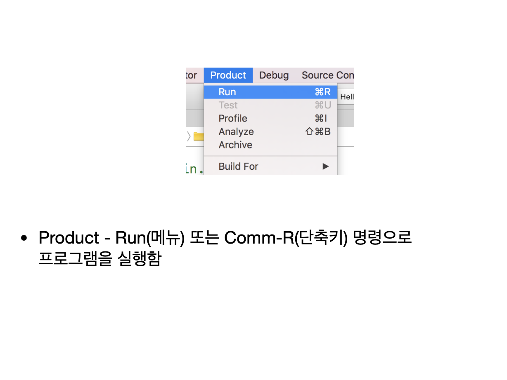

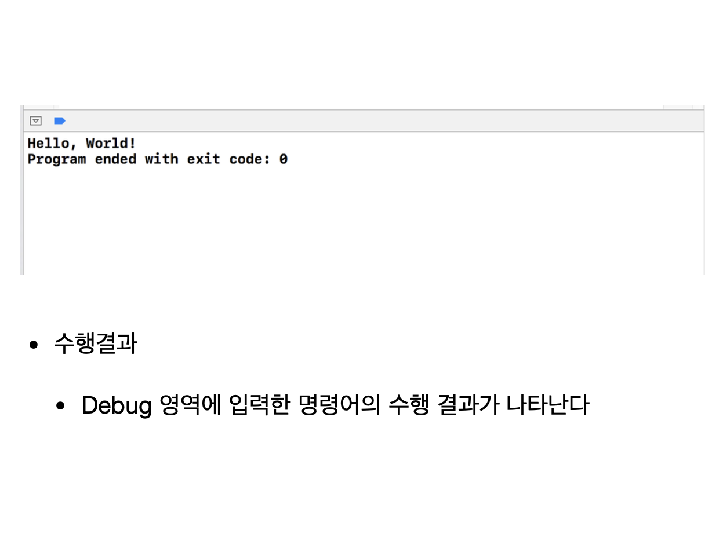


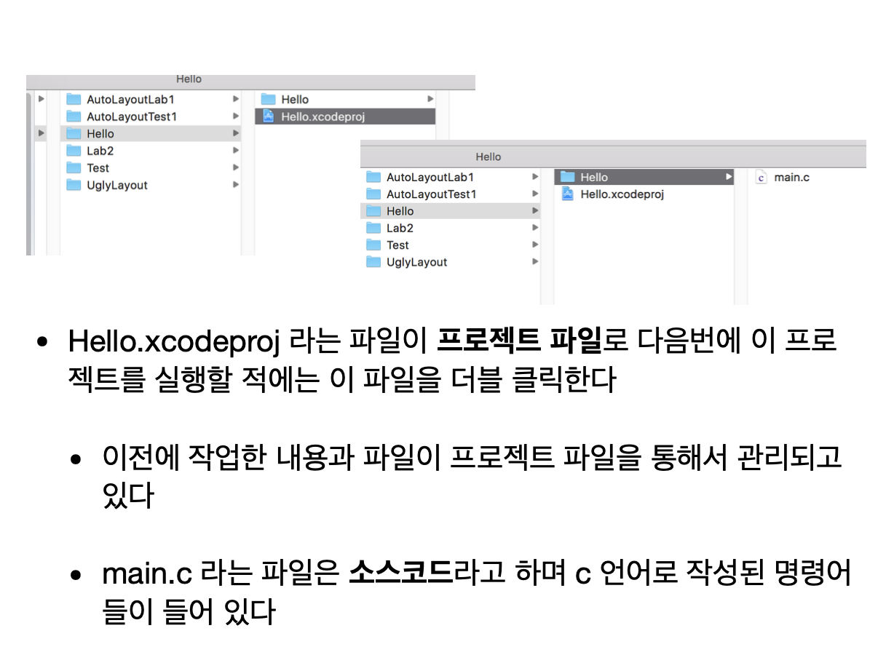


## 실습

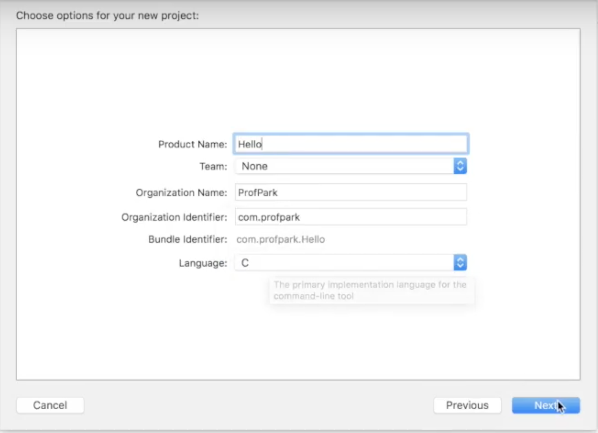

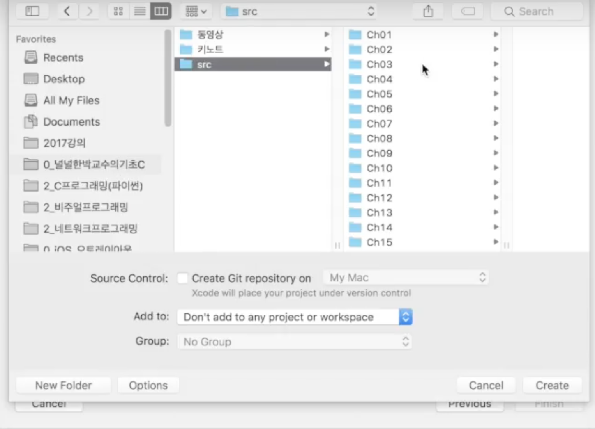

```c
// Code

#include <stdio.h>

int main(int argc, const char * argv[]) {
    // insert code here...
    printf("Hello, World!\n");
    printf("Hi there!\n");
    return 0;
}
```

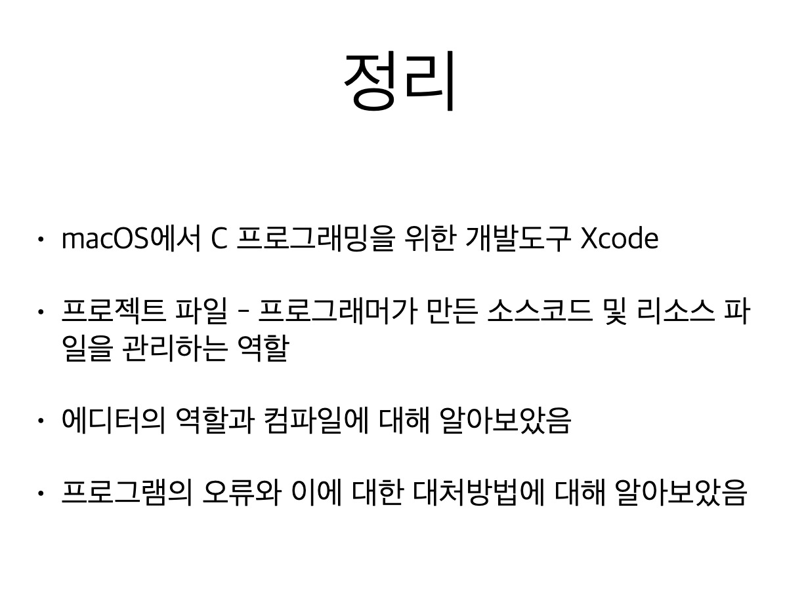


