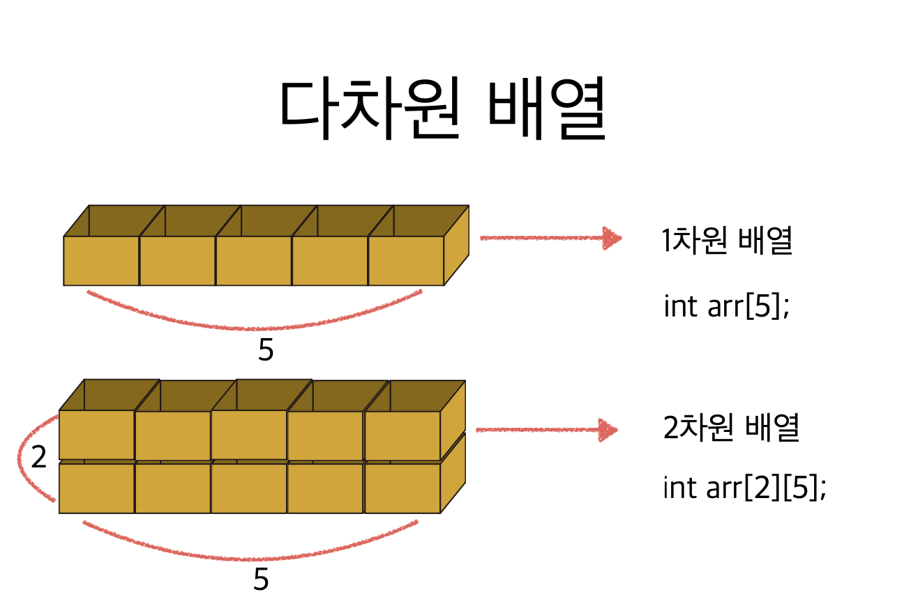

# 3. 다차원 배열




```c
#include <stdio.h>

int main(void) {
    // 2는 행의 갯수, 5는 열의 갯
    int arr[2][5] = {
        {0, 1, 2, 3, 4},
        {5, 6, 7, 8, 9}
    };
    
    int sum = 0;
    
    for (int i=0; i<2; i++) {
        for (int j=0; j<5; j++) {
            sum += arr[i][j];
        }
    }
    printf("2차원 배열의 합은: %d\n", sum);
    
    return 0;
}
```


