# 3. 포인터 변수의 참조와 증가연산

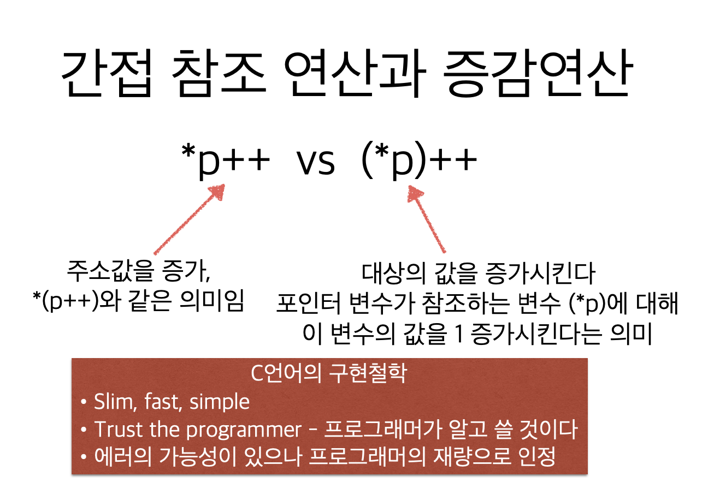

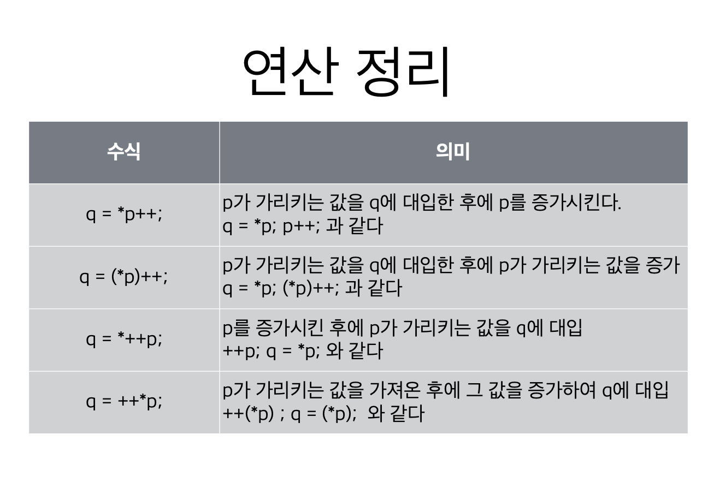


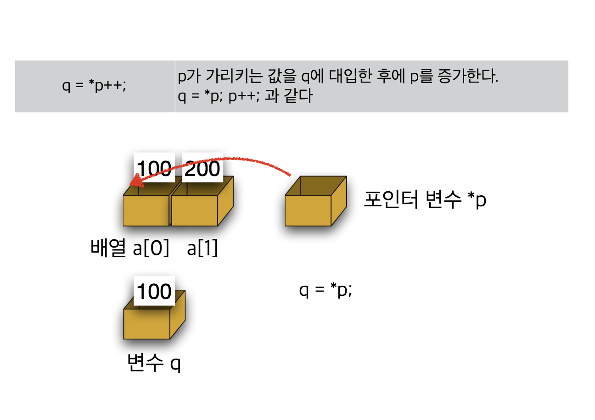


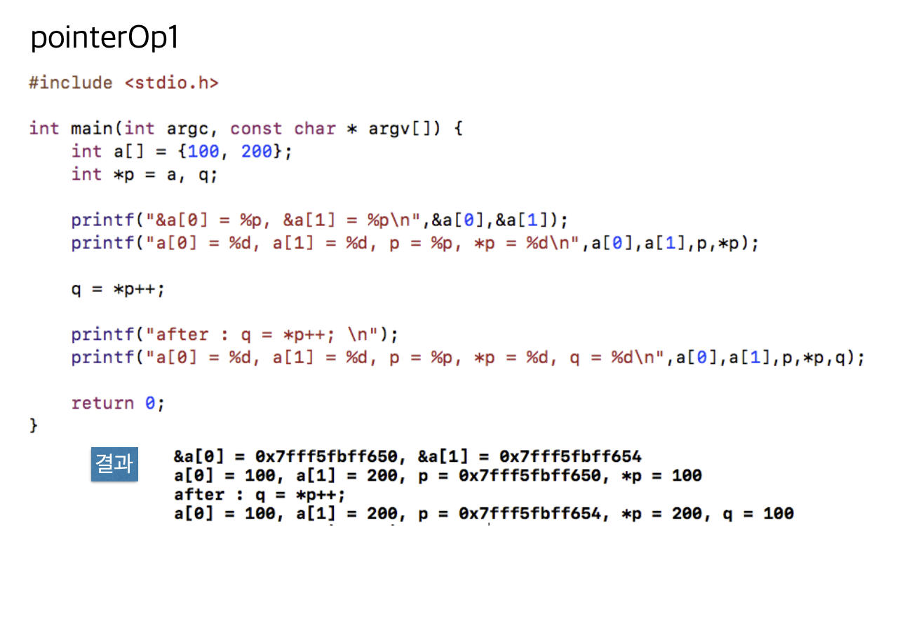

```c
#include <stdio.h>

int main(void) {
    int a[] = {100, 200};
    int *p = a, q;
    
    printf("&a[0] = %p, &a[1] = %p\n", &a[0], &a[1]);
    printf("a[0] = %d, a[1] = %d, p =%p, *p = %d\n", a[0], a[1], p, *p);
    
    q = *p++;
    
    printf("after: q = *p++; \n");
    printf("a[0] = %d, a[1] = %d, p = %p, *p = %d, q = %d\n", a[0], a[1], p, *p, q);
    
    return 0;
}

```


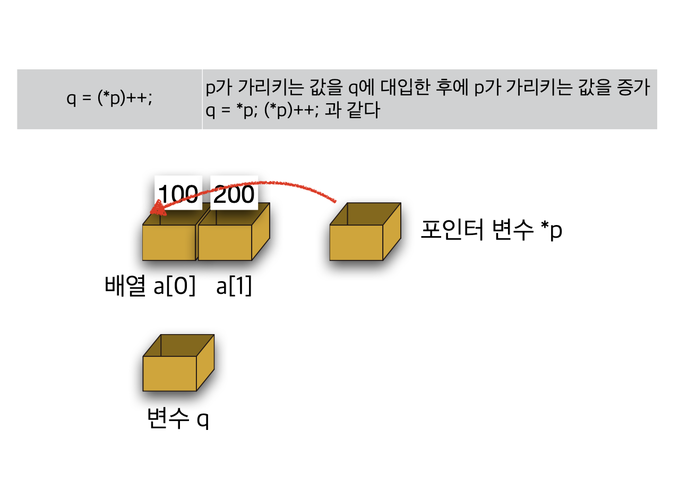

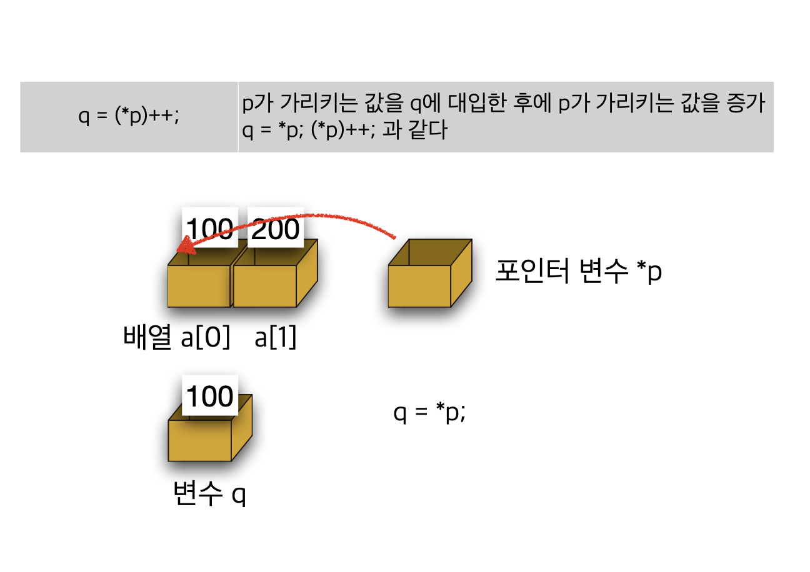

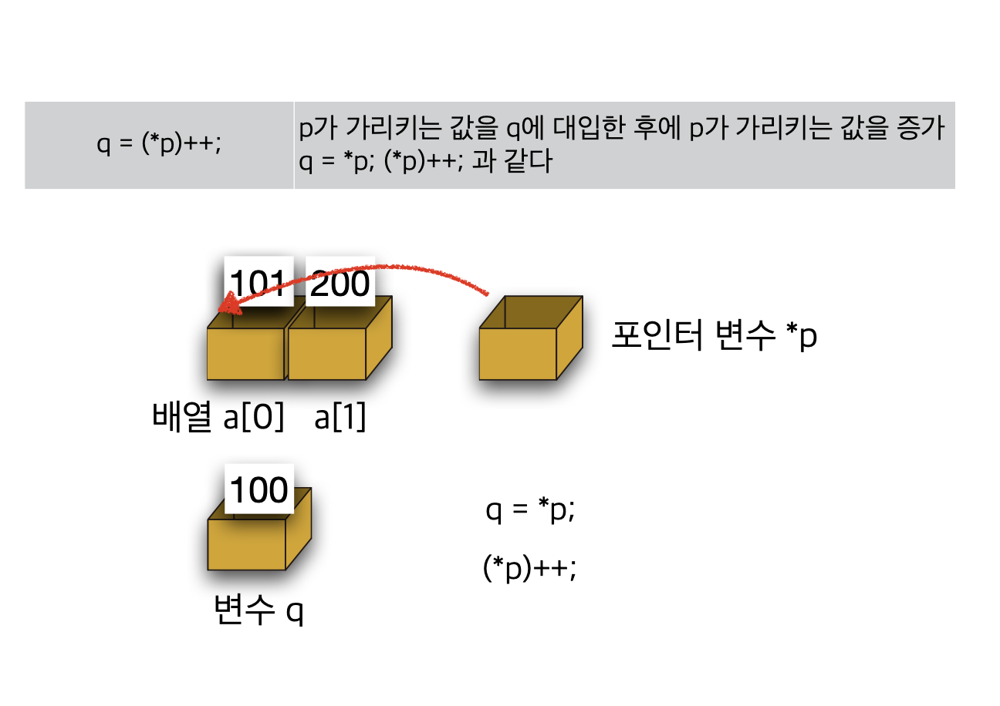

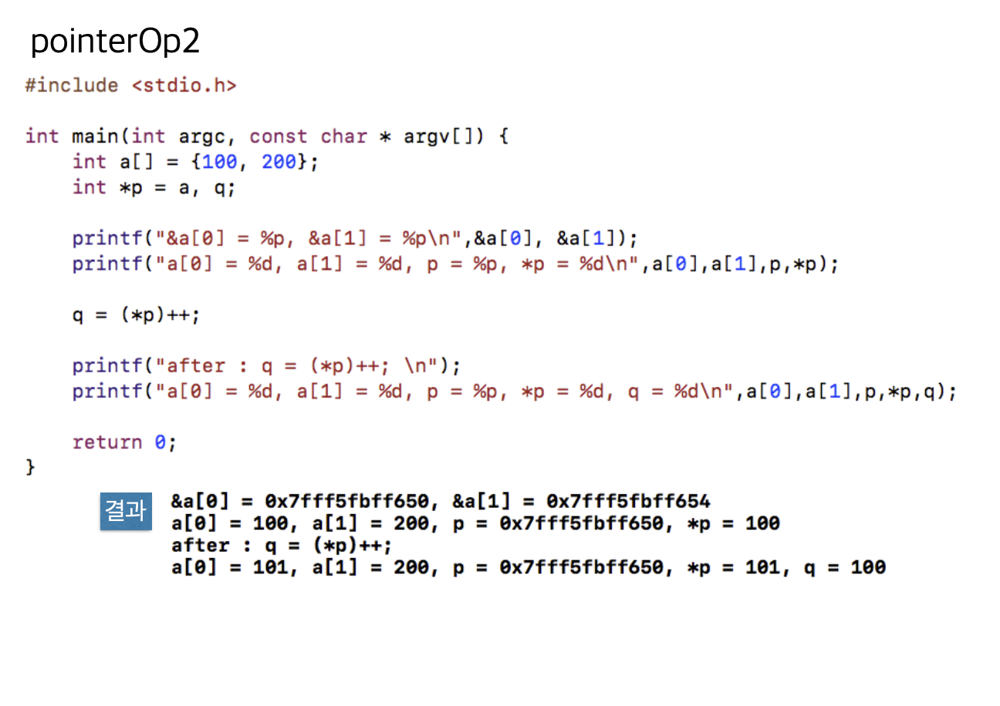

```c
#include <stdio.h>

int main(void) {
    int a[] = {100, 200};
    int *p = a, q;
    
    printf("&a[0] = %p, &a[1] = %p\n", &a[0], &a[1]);
    printf("a[0] = %d, a[1] = %d, p =%p, *p = %d\n", a[0], a[1], p, *p);
    
    q = (*p)++;
    
    printf("after: q = (*p)++; \n");
    printf("a[0] = %d, a[1] = %d, p = %p, *p = %d, q = %d\n", a[0], a[1], p, *p, q);
    
    return 0;
}
```

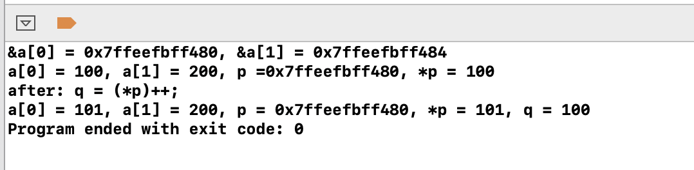

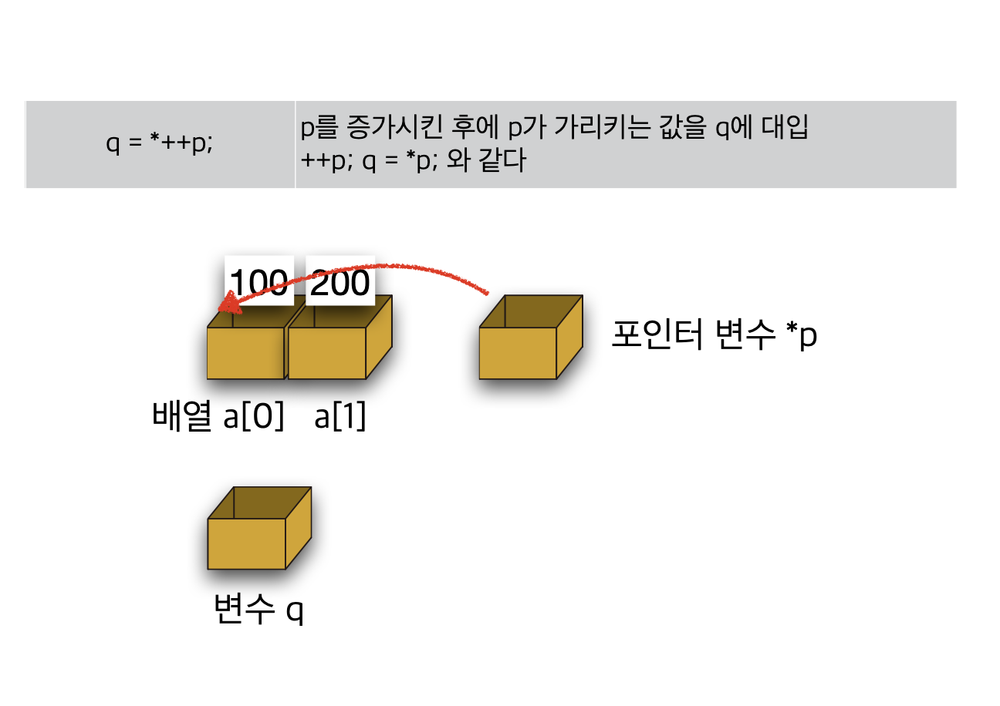


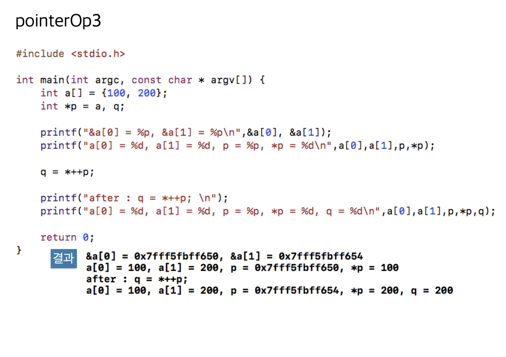

```c
#include <stdio.h>

int main(void) {
    int a[] = {100, 200};
    int *p = a, q;
    
    printf("&a[0] = %p, &a[1] = %p\n", &a[0], &a[1]);
    printf("a[0] = %d, a[1] = %d, p =%p, *p = %d\n", a[0], a[1], p, *p);
    
    q = *++p;
    
    printf("after: q = *++p; \n");
    printf("a[0] = %d, a[1] = %d, p = %p, *p = %d, q = %d\n", a[0], a[1], p, *p, q);
    
    return 0;
}

```

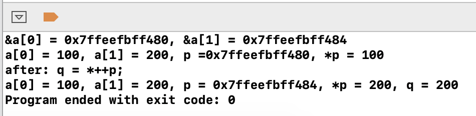


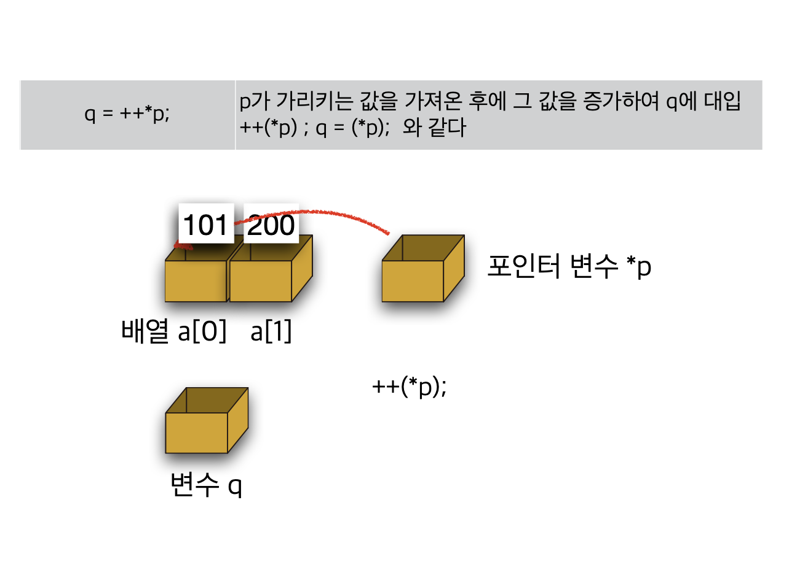

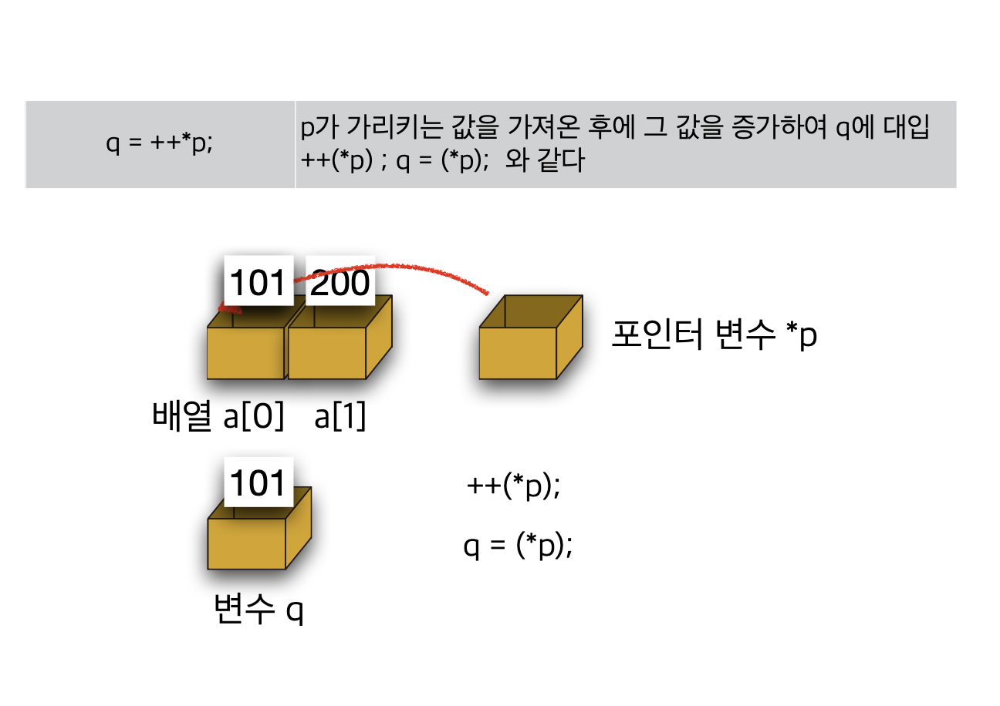

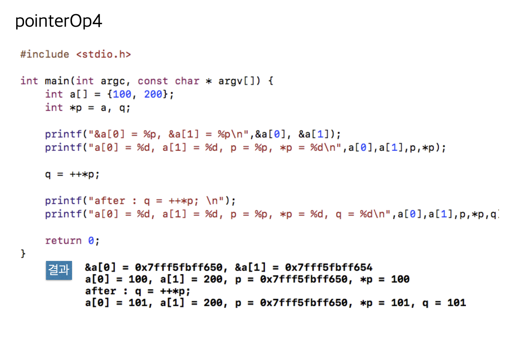

```c
#include <stdio.h>

int main(void) {
    int a[] = {100, 200};
    int *p = a, q;
    
    printf("&a[0] = %p, &a[1] = %p\n", &a[0], &a[1]);
    printf("a[0] = %d, a[1] = %d, p =%p, *p = %d\n", a[0], a[1], p, *p);
    
    q = ++*p;
    
    printf("after: q = ++*p; \n");
    printf("a[0] = %d, a[1] = %d, p = %p, *p = %d, q = %d\n", a[0], a[1], p, *p, q);
    
    return 0;
}

```

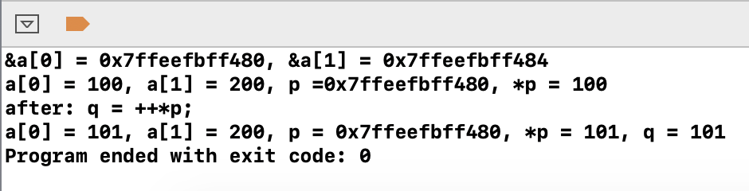


