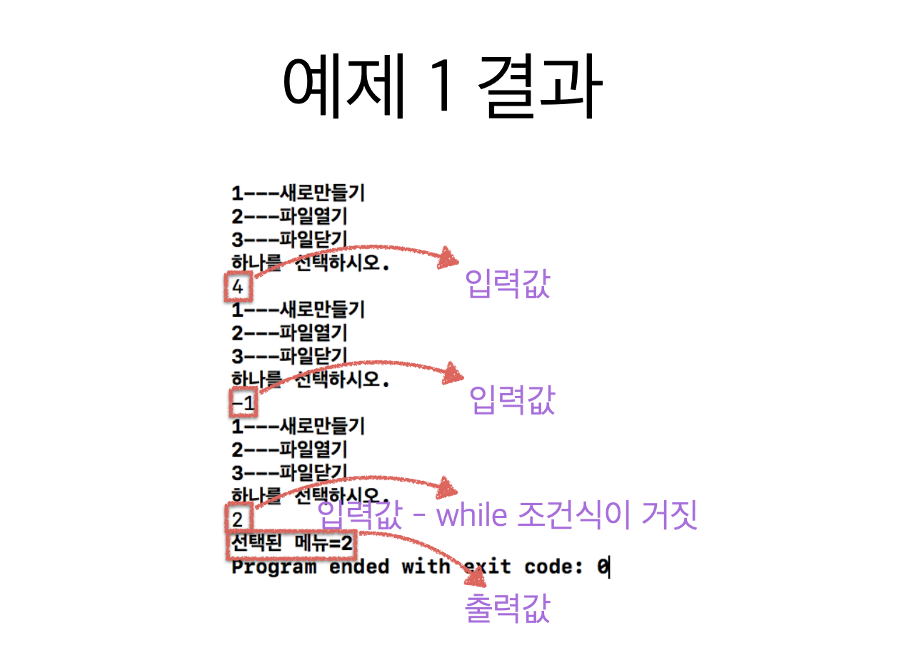

# 3. do while 반복문


```c
#include <stdio.h>

int main(void) {
    int i;
    printf("while문 출력\n");
    i = 0;
    
    while (i < 5) {
        printf("Hello ");
        i++;
    }
    printf("\n");
    
    printf("do-while문 출력\n");
    i = 0;
    
    do {
        printf("Hello ");
        i++;
    } while (i < 5);
    printf("\n");
}

```




```c
#include <stdio.h>

int main(void) {
    int i = 0;
    
    do {
        printf("1---새로 만들기\n");
        printf("2---파일 열기\n");
        printf("3---파일 닫기\n");
        printf("하나를 선택하시오.\n");
        scanf("%d", &i);
    } while (i < 1 || i > 3);
    
    printf("선택된 메뉴: %d\n", i);
    
    return 0;
}

```


