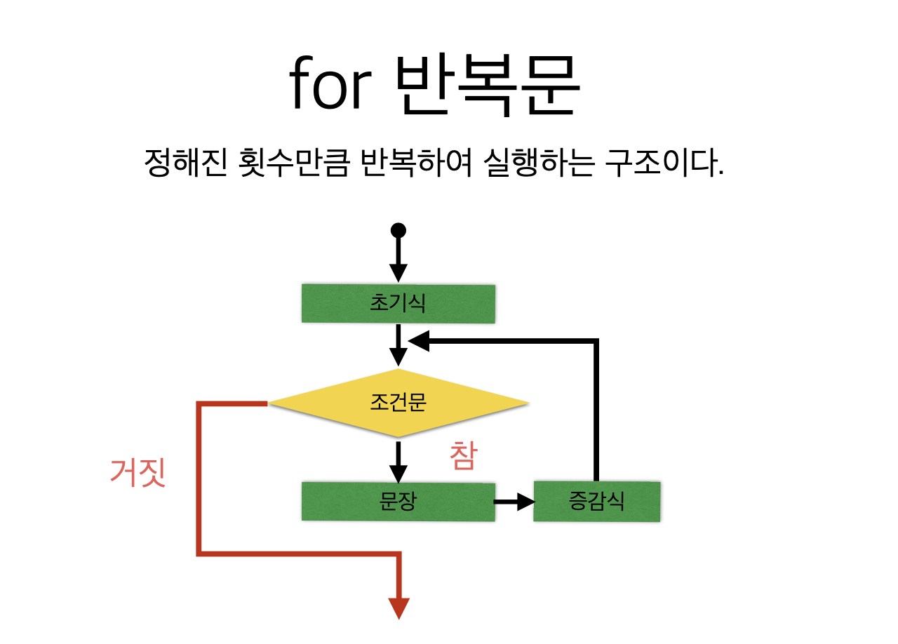
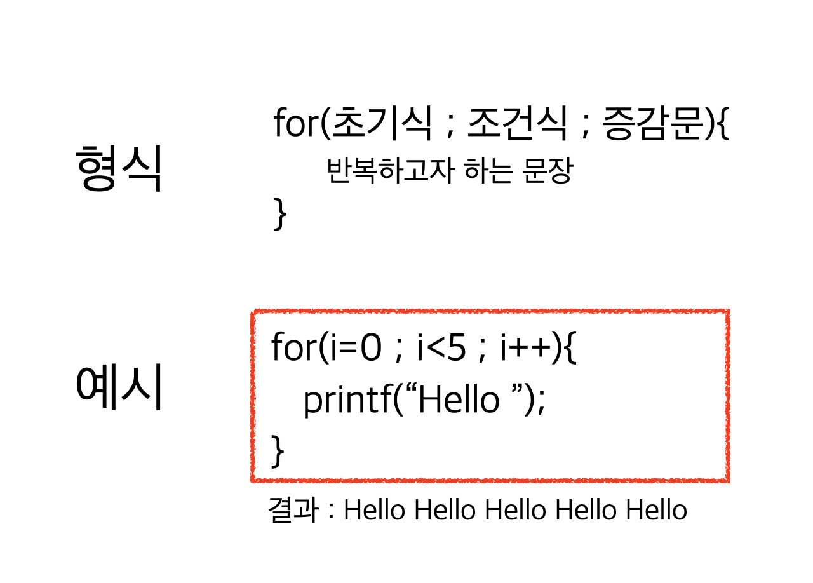
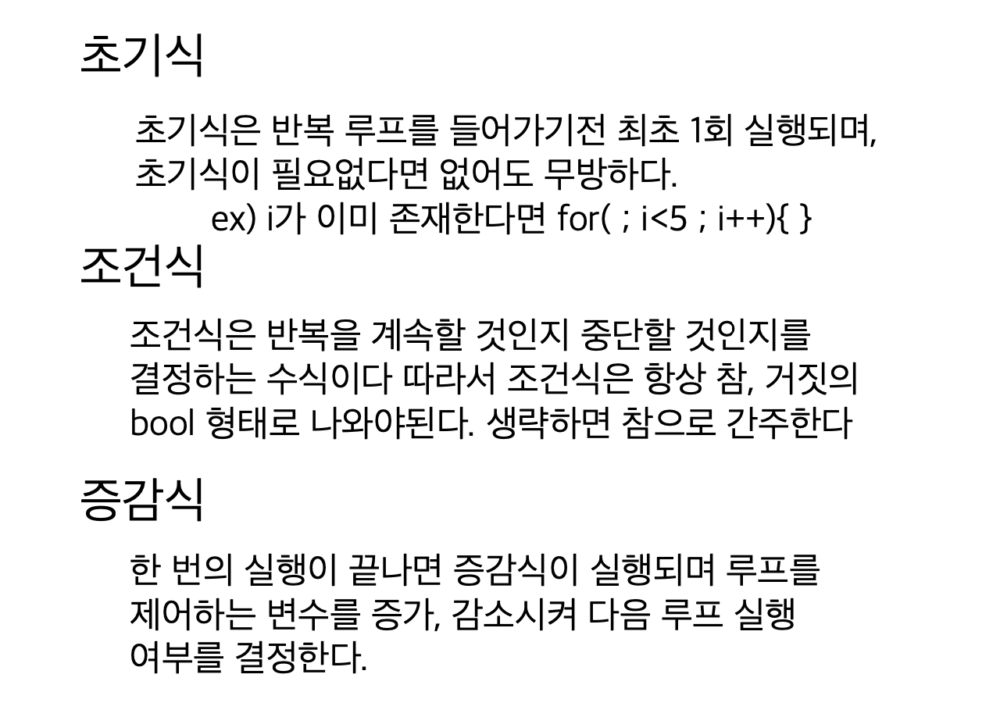
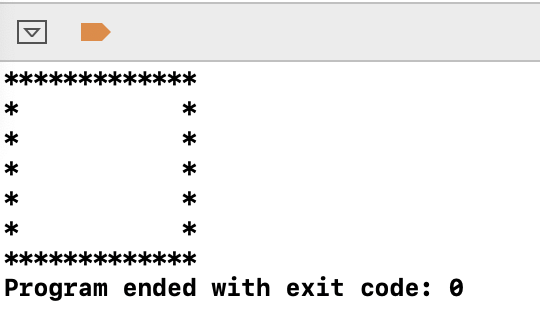
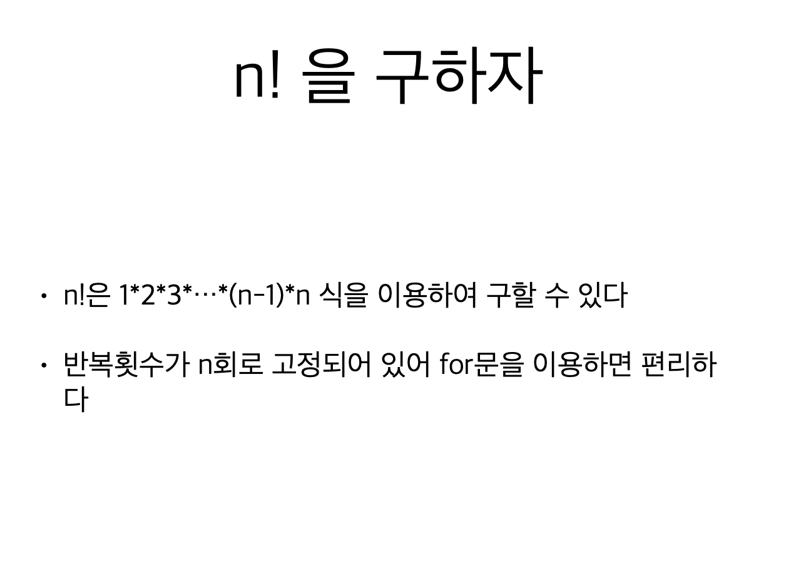
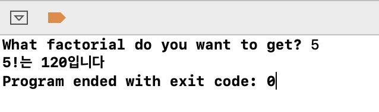

# 4. for 반복문







```c
#include <stdio.h>

int main(void) {
    printf("*************\n");
    for (int i = 0; i < 5; i++) {
        printf("*           *\n");
    }
    printf("*************\n");
    return 0;
}
```





```c
#include <stdio.h>

int main(void) {
    int facNum = 1;
    int i, n;
    printf("What factorial do you want to get? ");
    scanf("%d", &n);
    for (i=1; i<=n; i++) {
        facNum = facNum * i;
    }
    printf("%d!는 %d입니다\n", n, facNum);
    
    return 0;
}

```




