# 1. 변수와 자료형

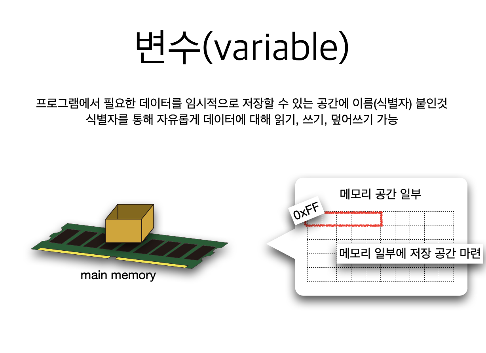

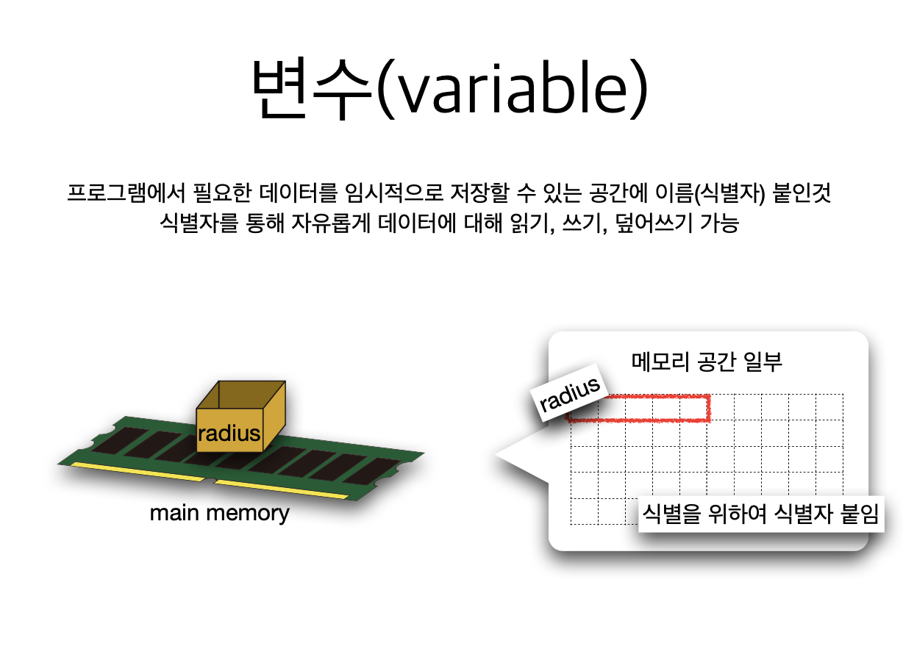

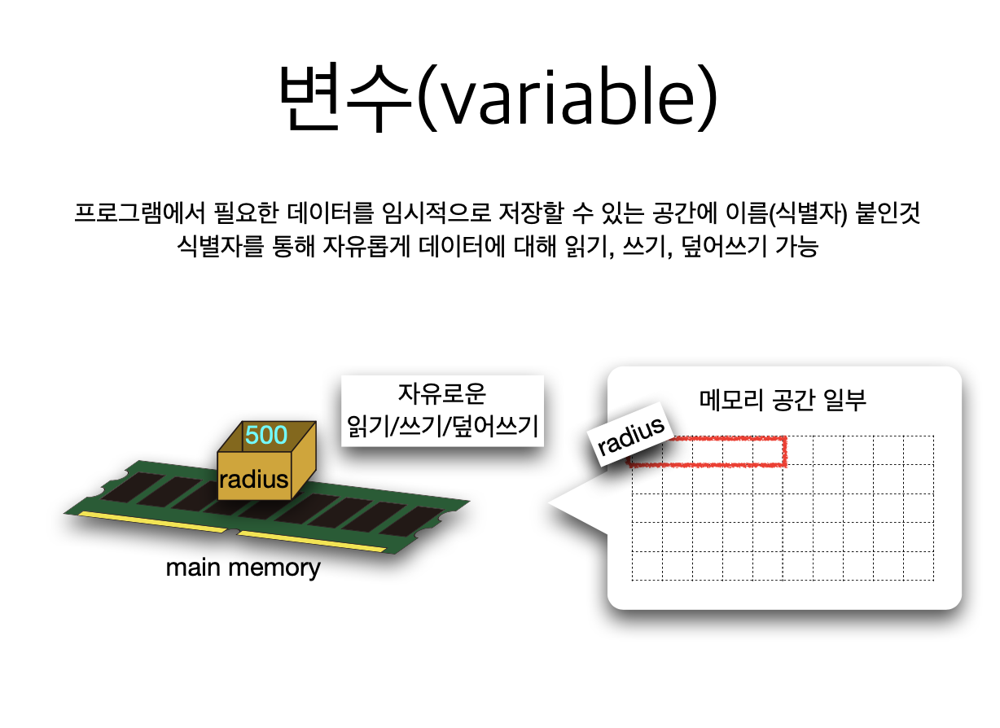

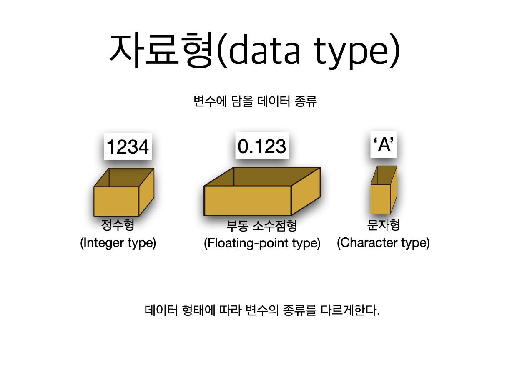

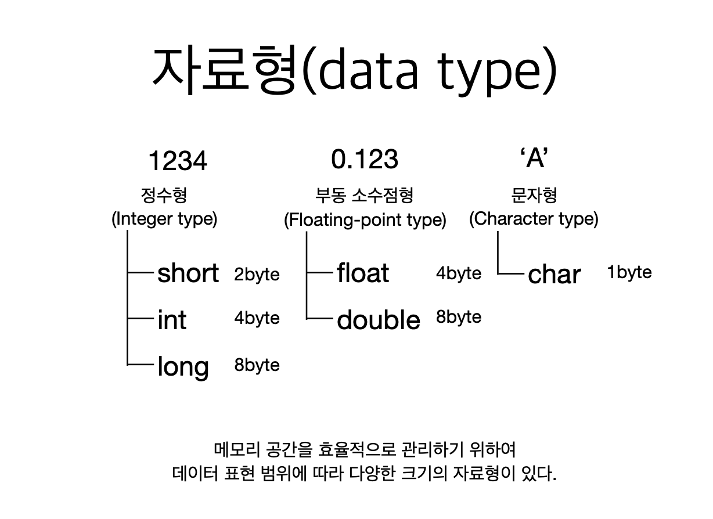

## 자료형의 크기를 구하는 프로그램

```c
/*
 자료형의 크기를 구하는 프로그램
 */
#include <stdio.h>

int main(void)
{
    int x;
    printf("변수 x의 크기: %d\n", sizeof(x));
    
    printf("char형의 크기: %d\n", sizeof(char));
    printf("int 형의 크기: %d\n", sizeof(int));
    printf("short 형의 크기: %d\n", sizeof(short));
    printf("long 형의 크기: %d\n", sizeof(long));
    printf("float 형의 크기: %d\n", sizeof(float));
    printf("double 형의 크기: %d\n", sizeof(double));
    
    return 0;
}
```

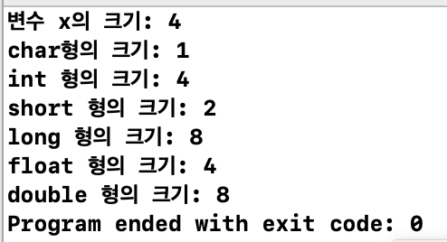

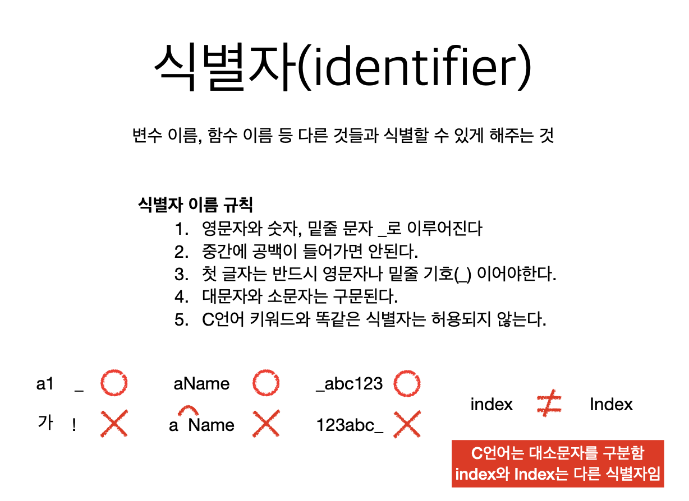

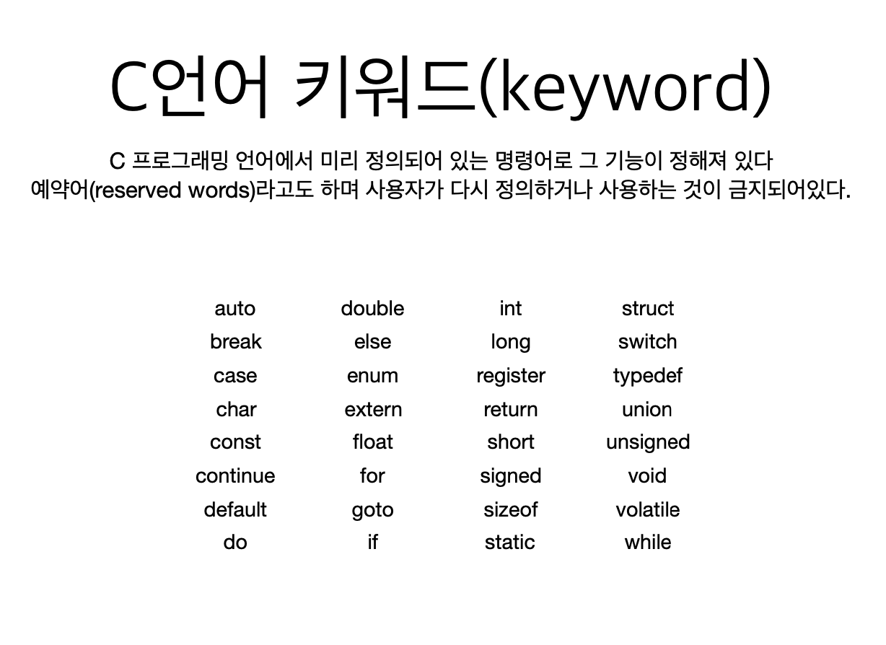

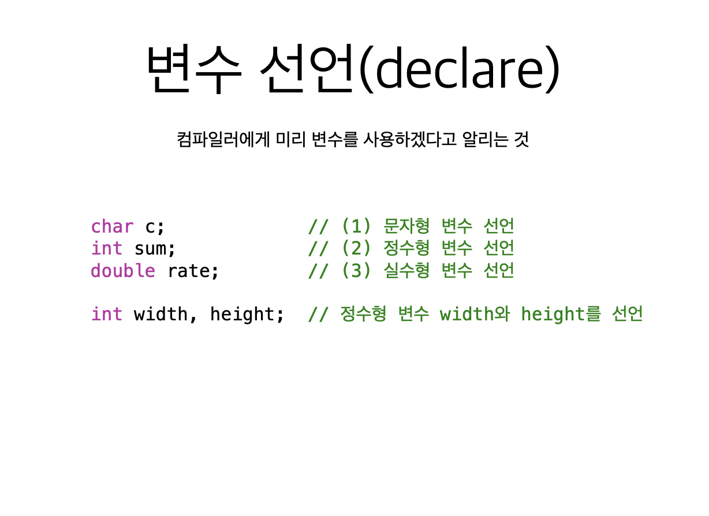

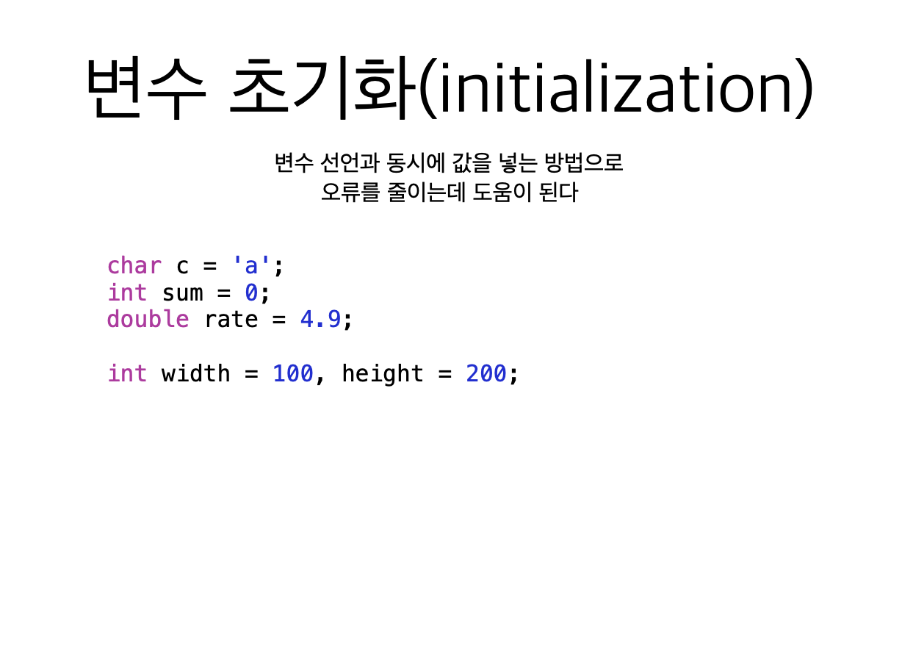

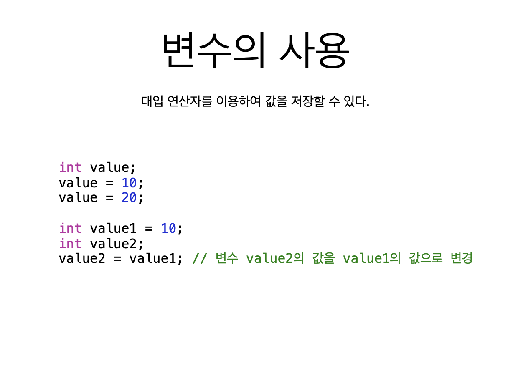

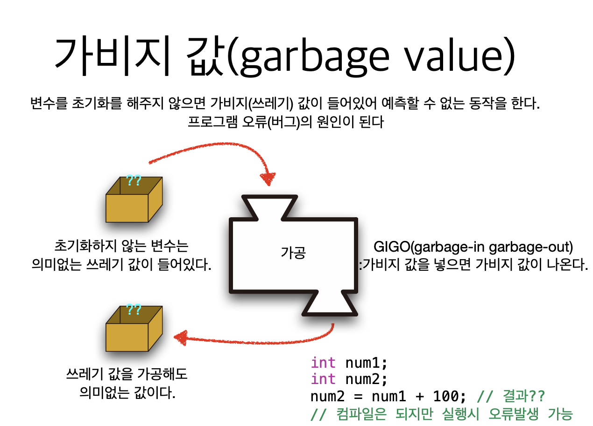

