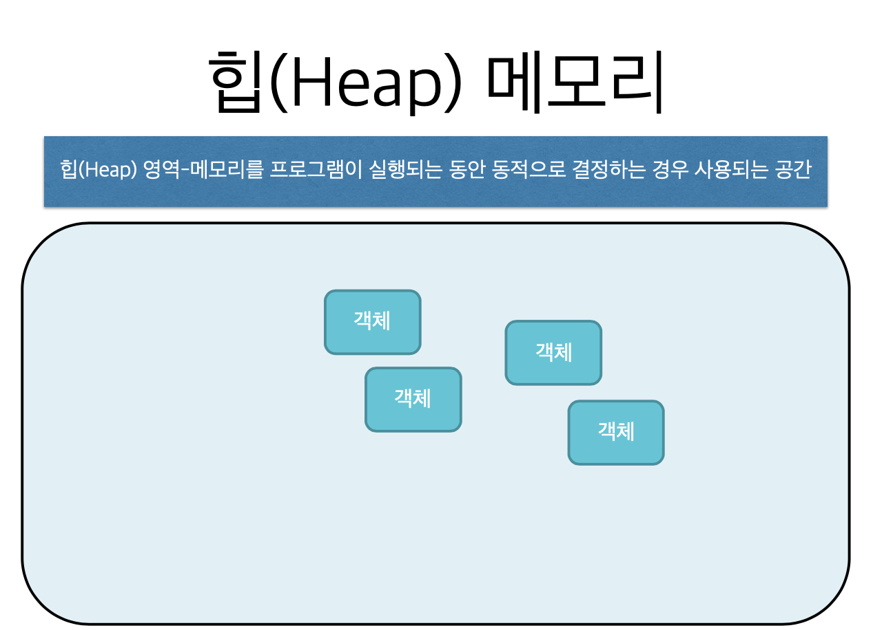

# 4. 배열과 동적 메모리 할당


```c
#include <stdio.h>

int main(void) {
    int a[5] = {20, 30, 40};
    
    // a와 &a[0] 의 값을 확인하는 printf
    printf("a = %p, &a[0] = %p\n", a, &a[0]);
    
    // a[0], a[1], ...와 *(a+0), *(a+1), *(a+2), ...
    for (int i=0; i<5; i++)
        printf("a[%d] = %d, *(a+%d) = %d\n", i, a[i], i, *(a+i));
    
    return 0;
}

```





```c
#include <stdio.h>
#include <stdlib.h>

int main(void) {
    int *a;
    
    // 컴파일 할 때 할당하는 것이 아니라, 실행하면서 할당
    a = (int *)malloc(5 * sizeof(int));
    
    if (a == NULL) {
        printf("메모리 할당 에러\n");
        return -1;
    }
    
    *a = 20;
    *(a + 1) = 30;
    *(a + 2) = 40;
    *(a + 3) = 0;
    *(a + 4) = 0;
    
    for (int i=0; i<5; i++)
        printf("a[%d] = %d, *(a+%d) = %d\n", i, a[i], i, *(a+i));
    free(a);
    
    return 0;
}
```


