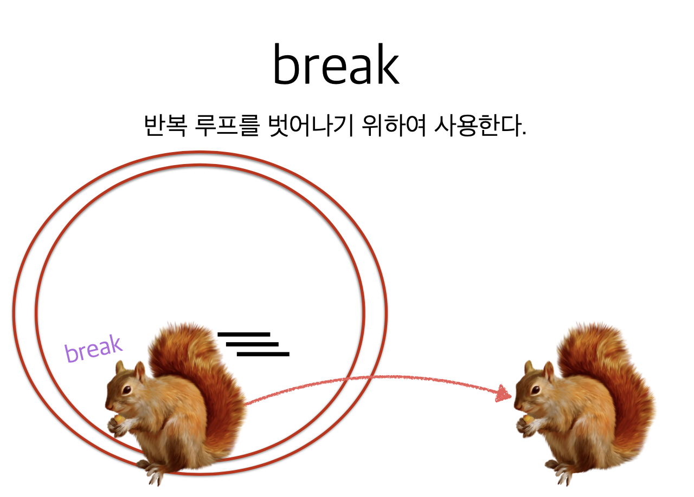
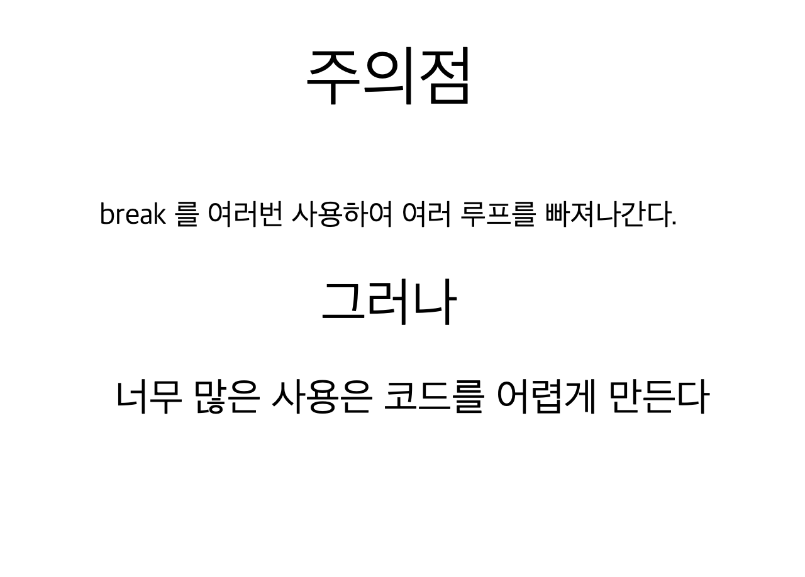
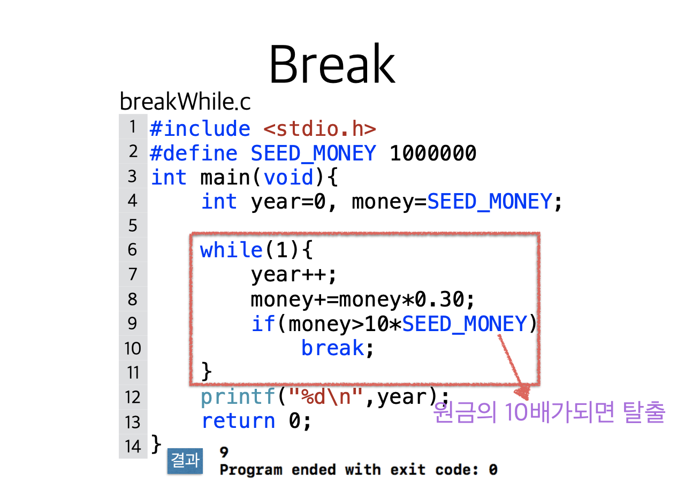
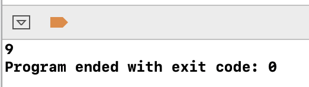
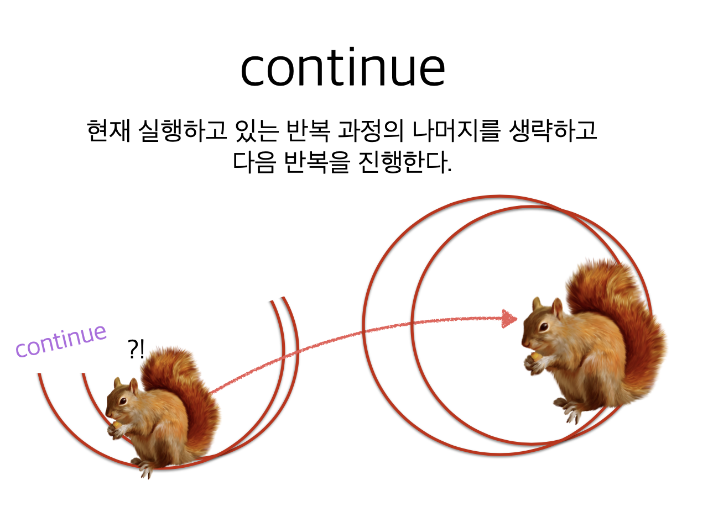
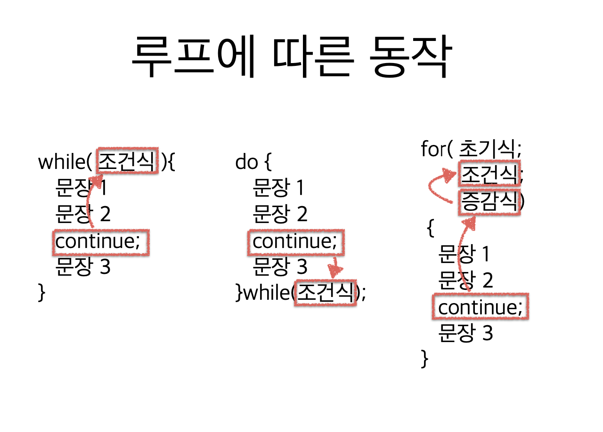
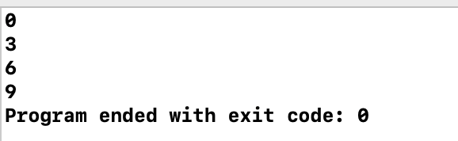

# 5. break 와 continue







```c
#include <stdio.h>
#define SEED_MONEY 100000

int main(void) {
    int year = 0, money = SEED_MONEY;
    
    // 원금의 10배로 불어나는 시
    while(1) {
        year++;
        money += money*0.30;
        
        if (money > 10*SEED_MONEY)
            break;
    }
    printf("%d\n", year);
    
    return 0;
}
```







```c
#include <stdio.h>

int main(void) {
    int i;
    
    for (i=0; i<10; i++) {
        if (i%3 != 0)
            continue;
        printf("%d\n", i);
    }
    return 0;
}

```



