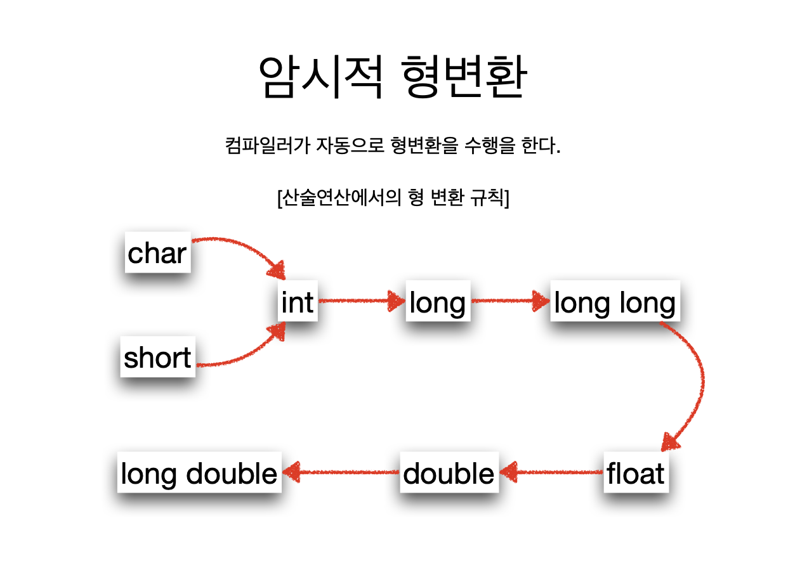

# 1. 수식과 연산자


```c
/*
 여러가지 연산들
 */
#include <stdio.h>

int main(int argc, const char * argv[]) {
    int num1 = 7, num2 = 4, result;
    
    printf("num1 = %d, num2 = %d 일 때\n", num1, num2);
    
    printf("num1 + num2 = %d\n", num1 + num2);
    printf("num1 - num2 = %d\n", num1 - num2);
    printf("num1 * num2 = %d\n", num1 * num2);
    printf("num1 / num2 = %d\n", num1 / num2);
    printf("num1 %% num2 = %d\n", num1 % num2);
    
    return 0;
}

```


* 즉 y = ++x 는 x의 값을 먼저 올리고 y에 대입하니 y 도 2가 되는 것이고,
* y = x++; 는 x의 기존 값을 먼저 y에 대입하고 x의 값을 1 증가시키니 x 는 2가 되지만, y는 그대로 1이다.


```c
/*
 복합대입연산자 예제
 */
#include <stdio.h>

int main(int argc, const char * argv[]) {
    int x = 20;
    printf("x = %d입니다\n", x);
    
    x += 10;
    printf("x += 10; 의 결과 x = %d\n", x);
    
    x -= 10;
    printf("x -= 10; 의 결과 x = %d\n", x);
    
    return 0;
}

```


```c
/*
 자동형변환
 */
#include <stdio.h>

int main(int argc, const char * argv[]) {
    double f;
    f = 10;         // f는 10.000000으로 자동형변환됨
    printf("f=%f\n", f);
    
    int i;
    char x;
    i = 3.14;
    x = 10000;
    printf("i = %d, x = %d\n", i, x);
    
    char ch = 'a';
    short s = 100;
    printf("result = %d\n", ch+s);
    
    return 0;
}
```





### 형변환한다고 변수의 형이 변환 되는 것이 아닌 값만 형변환된다


