# 1. 조건문

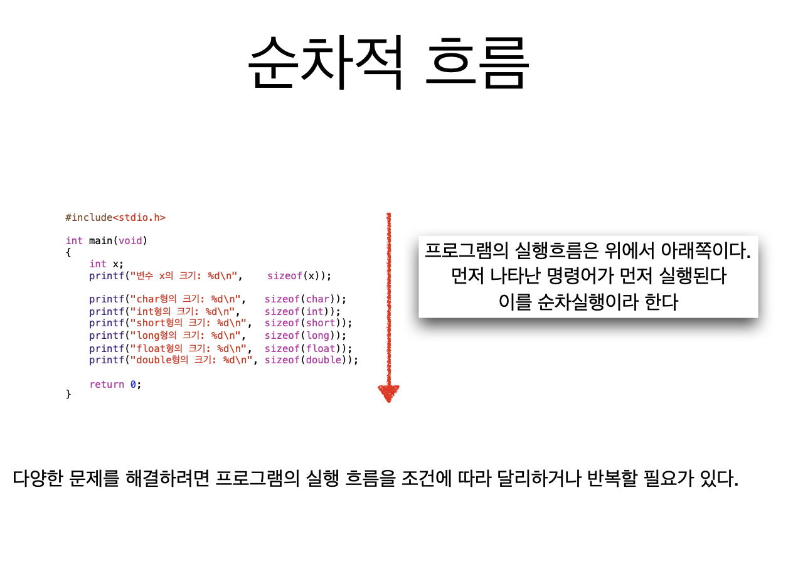

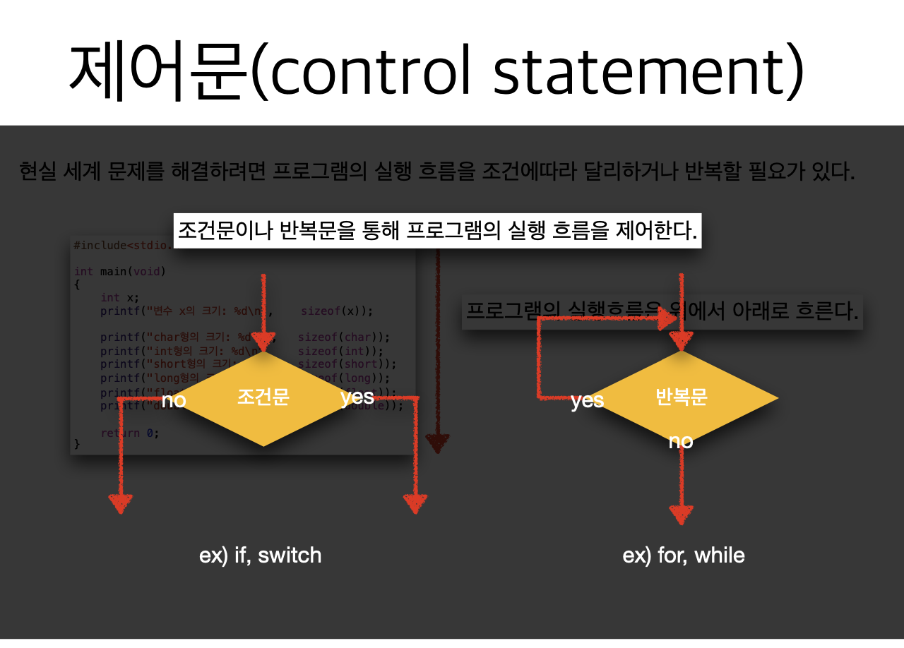

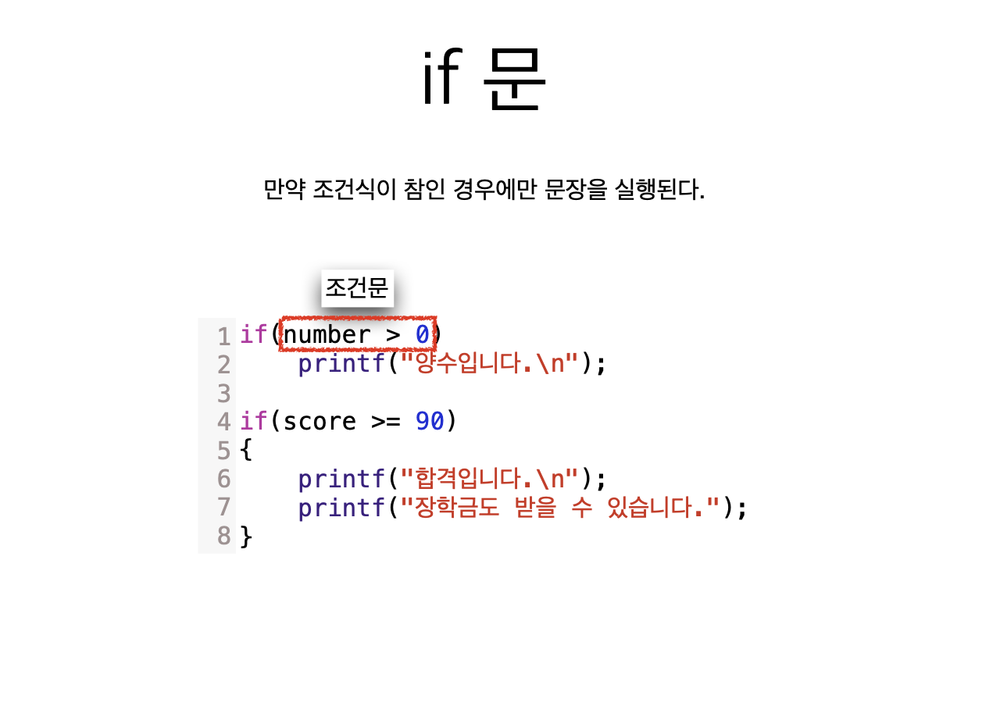

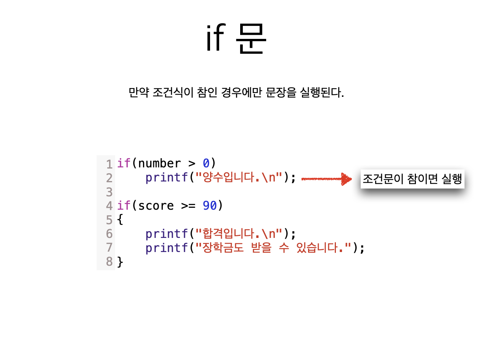

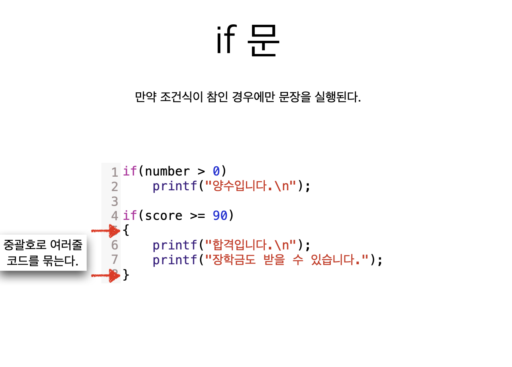

```c
/*
 절댓값을 구하는 프로그램
 */
#include <stdio.h>

int main(void)
{
    int number;
    
    printf("정수를 입력하시요: ");
    scanf("%d", &number);
    
    if (number < 0) {
        number = -number;
    }
    
    printf("절댓값은 %d입니다.\n", number);
    return 0;
}
```

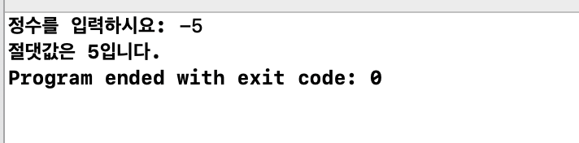


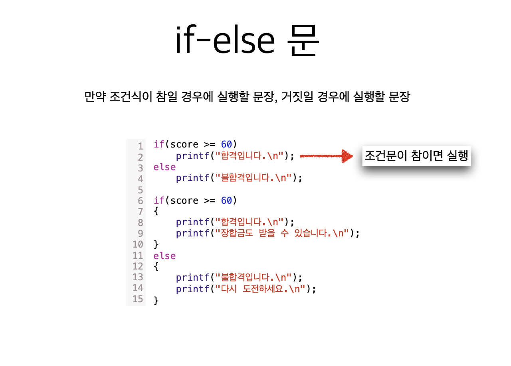

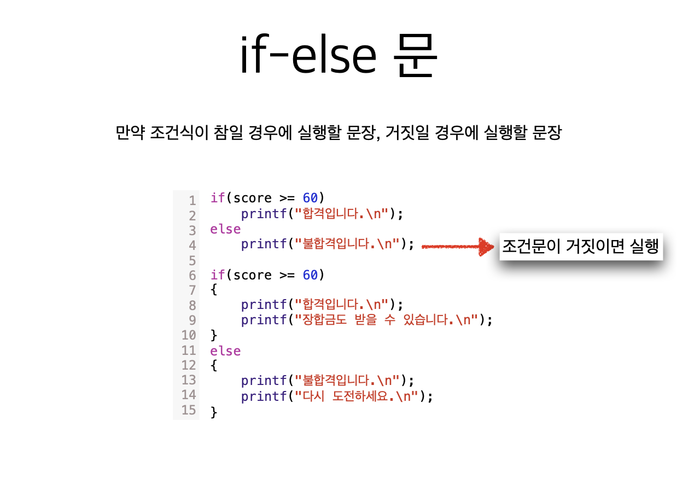

```c
/*
 if-else statement
 */

#include <stdio.h>

int main(void)
{
    int n, d, result;
    
    printf("분자를 입력하시오: ");
    scanf("%d", &n);
    
    printf("분모를 입력하시오: ");
    scanf("%d", &d);
    
    if (d == 0){
        printf("0으로 나눌 수 없습니다\n");
    } else{
        result = n / d;
        printf("결과는 %d입니다.\n", result);
    }
    
    return 0;
}
```

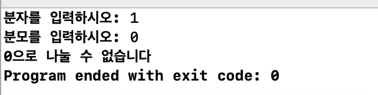


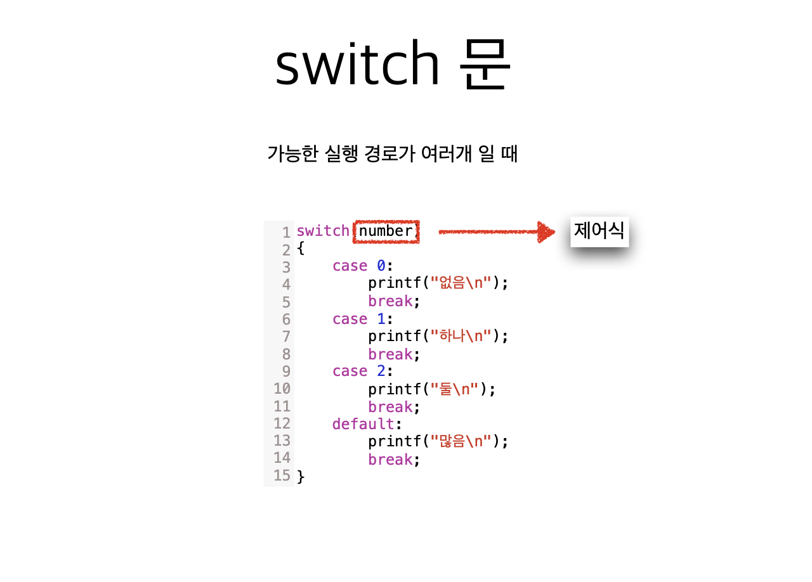

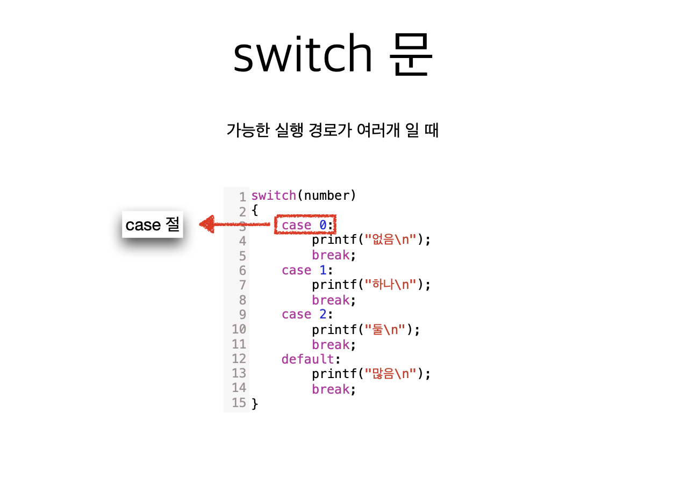

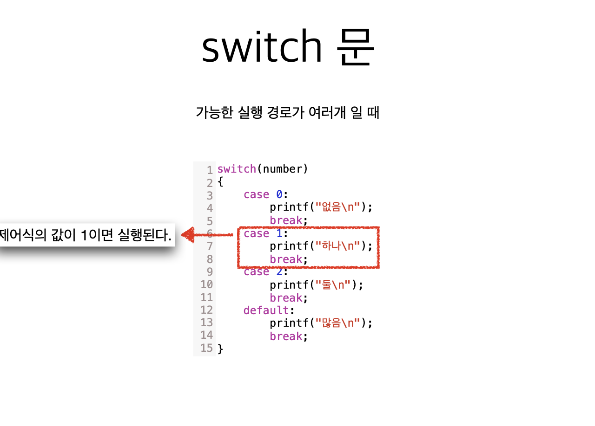

```c
/*
 switch statement
 */

#include <stdio.h>

int main(void)
{
    char op;
    int x, y, result = 0;
    
    printf("수식을 입력하시오\n");
    printf("(예: 2 + 5) \n");
    printf(">>> ");
    scanf("%d %c %d", &x, &op, &y);
    
    switch (op)
    {
        case '+':
            result = x + y;
            break;
        case '-':
            result = x - y;
            break;
        case '*':
            result = x * y;
            break;
        case '/':
            result = x / y;
            break;
        case '%':
            result = x % y;
            break;
        default:
            printf("지원되지 않는 연산자입니다.\n");
            break;
    }
    printf("%d %c %d = %d\n", x, op, y, result);
    
    return 0;
}
```

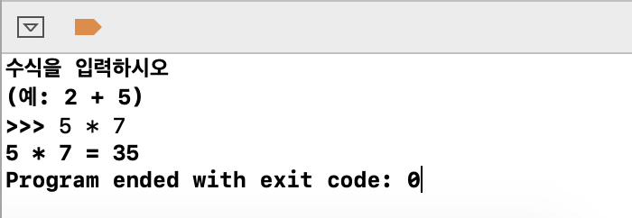


