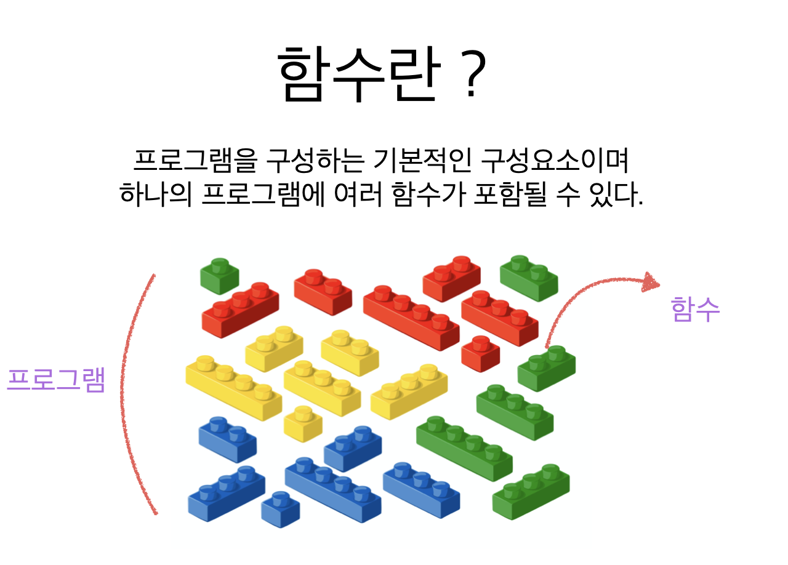
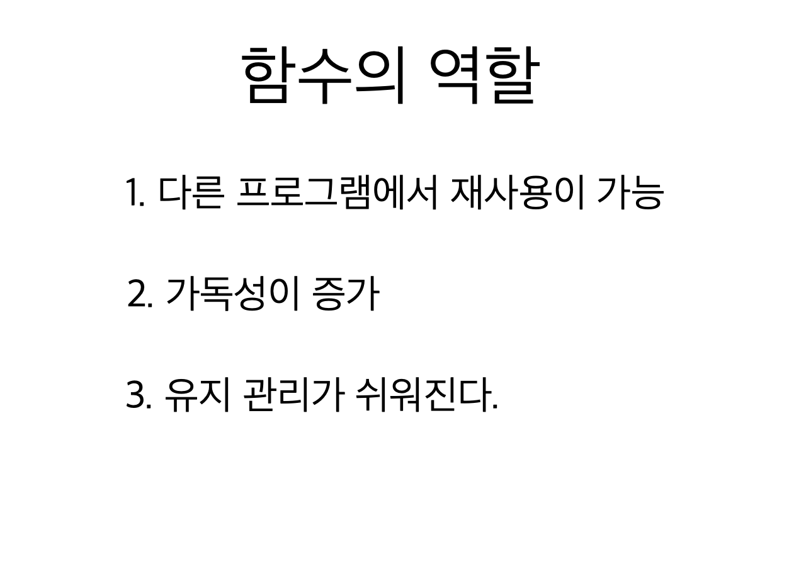
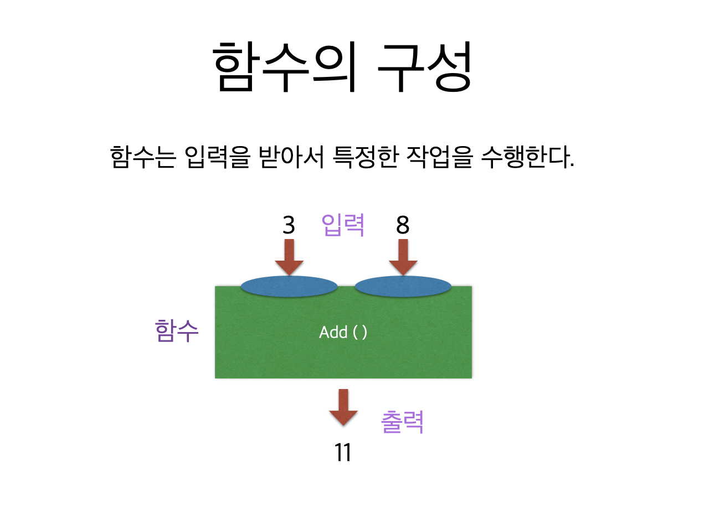
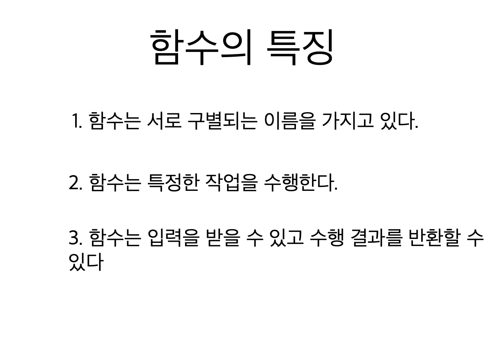
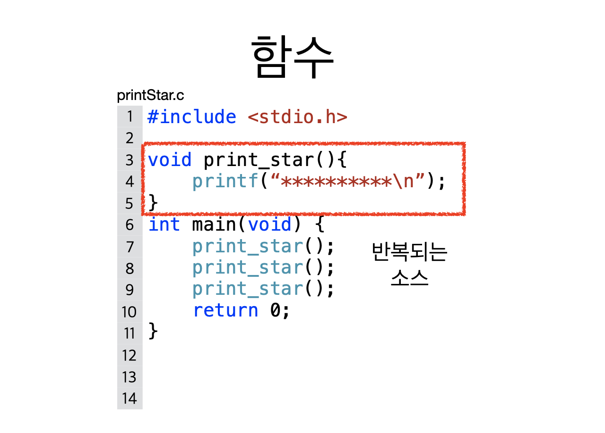
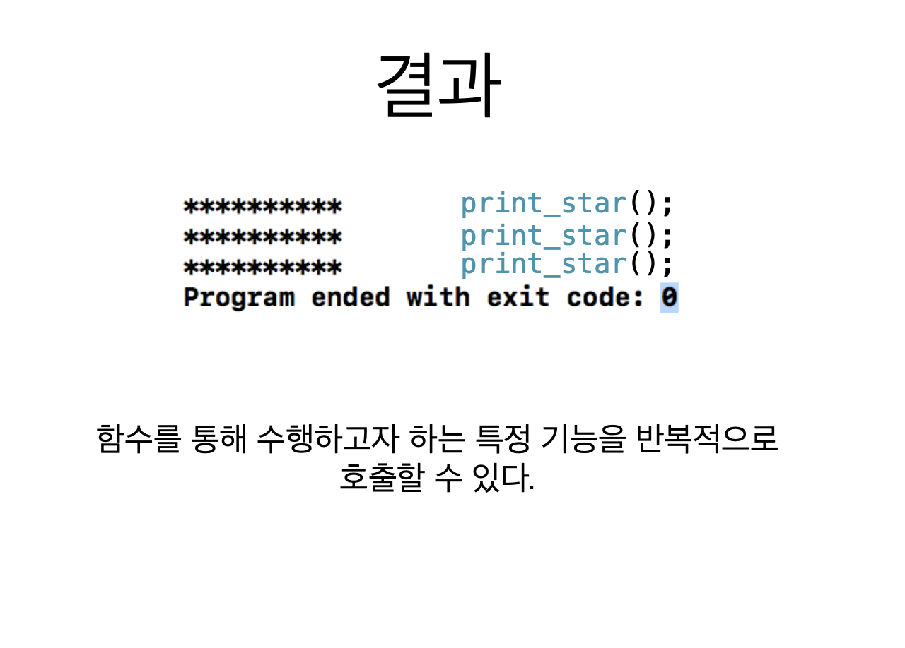
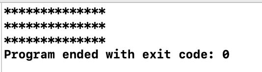

# 1. 함수














```c
#include <stdio.h>

void print_star() {
    printf("**************\n");
}

int main(void) {
    print_star();
    print_star();
    print_star();
    return 0;
}

```




